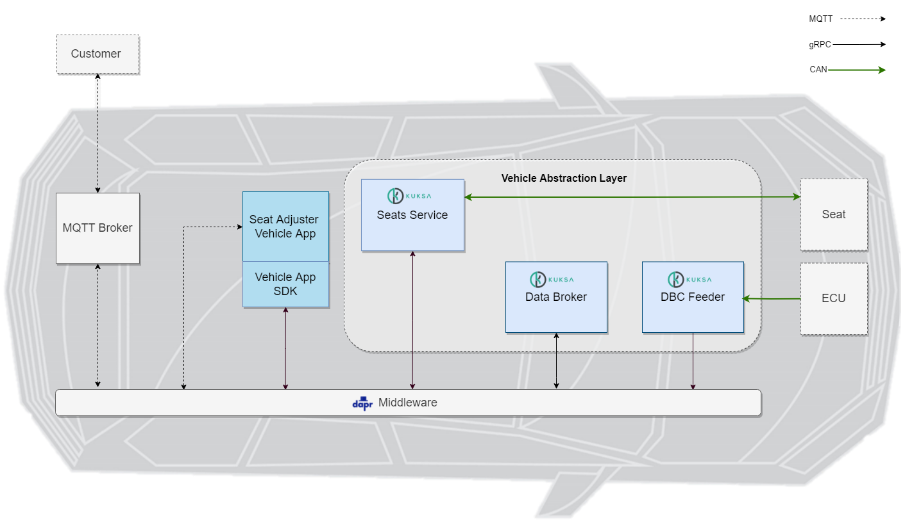

## Background

Traditionally, the automotive industry was and still is centered around vehicle hardware and the corresponding hardware development and life-cycle management. Software, however, is gaining more and more importance in vehicle development and over the entire vehicle lifetime. Thus, the vehicle and its value to the customer is increasingly defined by software. This transition towards what are termed as software-defined vehicles changes the way in which we innovate, code, deliver and work together. It is a change across the whole mobility value chain and life-cycle: from development and production to delivery and operations of the vehicle.

## Goal

The Eclipse project _Velocitas™_ provides an end-to-end, scalable and modular development toolchain to create containerized in-vehicle applications (_Vehicle Apps_) that offers a comfortable, fast and efficient development experience to increase the speed of a development team.

The repositories of the Eclipse project _Velocitas_ and their relations between each other can be found [[here](Reference/repository_overview.md)].

## Example Use Case

_Velocitas_ contains implementations based on the example use case of adjusting the vehicle seat position to showcase the development toolchain of a comfort function (QM level - non-safety relevant).

What could such a use case look like? Image a carsharing company that wants to offer its customers the functionality that the driver seat automatically moves to the right position, when the driver enters the rented car. The carsharing company knows the driver and has stored the preferred seat position of the driver in its driver profile. The car gets unlocked by the driver and a request for the preferred seat position of the driver will be sent to the vehicle.

That's where your implementation starts. The _Seat Adjuster VehicleApp_ receives the seat position as a MQTT message and triggers a seat adjustment command of the _Seat Service_ that changes the seat position. Of course, the driver of a rented car would like the position, that he may have set himself, to be saved by the carsharing company and used for the next trip. As a result, the _Seat Adjuster VehicleApp_ subscribes to the seat position and receives the new seat position from the _Vehicle Data Broker_ that streams the data from the _Seat Service_.

A detailed description of the _Seat Adjuster_ use case can be found [here](Reference/seat_adjuster_use_case.md).

## References

- [Vehicle Signal Specifications (VSS)](https://github.com/COVESA/vehicle_signal_specification)
