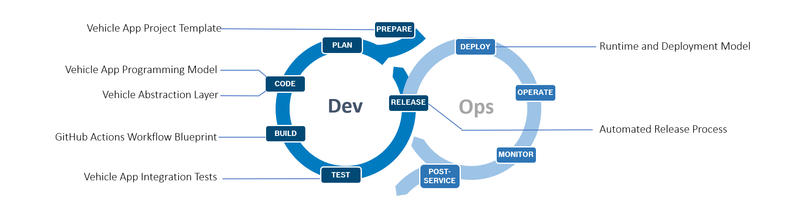

Eclipse _Velocitas™_ provides an end-to-end, scalable and modular development tool chain to create containerized in-vehicle applications (_Vehicle Apps_), offering a comfortable, fast and efficient development experience to increase the speed of a development team.

## What does Velocitas offer?

- Predefined CI/CD workflows that build (for multi architectures), test, document and deploy a Vehicle App help saving setup time
- DevContainer helps to install everything to start the local development immediately in Microsoft Visual Studio Code
- Vehicle API to abstract the vehicle's signals and E/E architecture helps to focus on business logic and enables _Vehicle Apps_ to be portable across different electric and electronic vehicle architectures
- Vehicle Apps skeleton and example Vehicle Apps helps to understand easily how to write a Vehicle Apps using the KUKSA VAL runtime services
- Higher development velocity through self-contained, containerized Apps with no dependencies to E/E architecture

## Feature Overview

|Feature |Python|C++ |
|-|-|-|
|Vehicle App Template | + | + |

|Vehicle App SDK | + | + |

|Vehicle Model Generator| + | + |

|DevConatiner for esay IDE setup | + | + |
|CI/CD workflows | + | + |
|Unit test support| + | + |
|Integration test support| + | |
|Digital Auto integration| + | |

## Concepts
