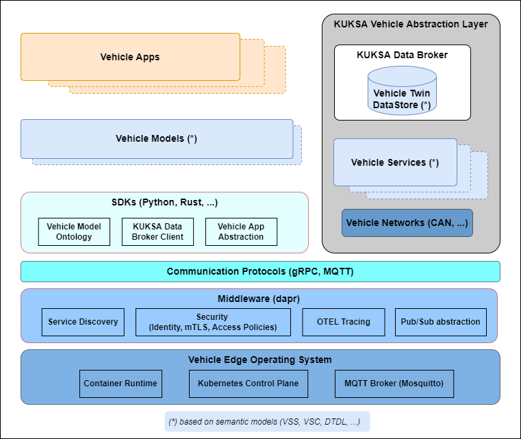
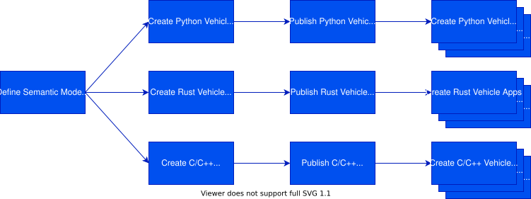

The Velocitas development model is centered around what are known as [Vehicle Apps](#vehicle-apps). Automation allows engineers to make high-impact changes frequently and deploy Vehicle Apps through cloud backends as over-the-air updates. The Vehicle App development model is about _speed_ and _agility_ paired with state-of-the-art software quality.

## Development Architecture

Velocitas provides a flexible development architecture for [Vehicle Apps](#vehicle-apps). The following diagram shows the major components of the Velocitas stack.

### Vehicle Apps

The Vehicle Applications (aka. Vehicle Apps) contain the business logic that needs to be executed on a vehicle. A Vehicle App is implemented on top of a [Vehicle Model](#vehicle-models) and its underlying language-specific [SDK](#sdks). Many concepts of cloud-native and [twelve-factor](https://12factor.net/) applications apply to Vehicle Apps as well and are summarized in the next chapter.

### Vehicle Models

A Vehicle Model makes it possible to easily get vehicle data from the [Data Broker](#data-broker) and to execute remote procedure calls over gRPC against [Vehicle Services](#vehicle-services) and other [Vehicle Apps](#vehicle-apps). It is generated from the underlying [semantic models](#semantic-models) for a concrete programming language as a graph-based, strongly-typed, intellisense-enabled library. The elements of the vehicle models are defined by the [SDKs](#sdks).

### SDKs

To reduce the effort required to implement [Vehicle Apps](#vehicle-apps), Velocitas provides a set of SDKs for different programming languages. SDKs are available for Python and C++, further SDKs for Rust and C are planned.
Next to a Vehicle Apps abstraction, the SDKs are [Middleware](#middleware)-enabled, provide connectivity to the [Data Broker](#data-broker) and contain the ontology in the form of base classes to create [Vehicle Models](#vehicle-models).

### Vehicle Services

Vehicle Services provide service interfaces to control actuators or to trigger (complex) actions. E.g. they communicate with the vehicle internals networks like CAN or Ethernet, which are connected to actuators, electronic control units (ECUs) and other vehicle computers (VCs). They may provide a simulation mode to run without a network interface. Vehicle services may feed data to the [Data Broker](#data-broker) and may expose gRPC endpoints, which can be invoked by [Vehicle Apps](#vehicle-apps) over a [Vehicle Model](#vehicle-models)

### Data Broker

Vehicle data is stored in the KUKSA Data Broker conforming to an underlying [Semantic Model](#semantic-models) like [VSS](https://covesa.github.io/vehicle_signal_specification/). [Vehicle Apps](#vehicle-apps) can either pull this data or subscribe for updates. In addition, it supports rule-based access to reduce the number of updates sent to the Vehicle App.

### Semantic models

The Vehicle Signal Specification ([VSS](https://covesa.github.io/vehicle_signal_specification/)) provides a domain taxonomy for vehicle signals and defines the vehicle data semantically, which is exchanged between Vehicle Apps and the Data Broker.

The Vehicle Service Catalog ([VSC](https://github.com/COVESA/vehicle_service_catalog#vehicle-service-catalog)) extends VSS with functional remote procedure call definitions and semantically defines the gRPC interfaces of Vehicle Services and Vehicle Apps.

As an alternative to VSS and VSC, vehicle data and services can be defined semantically in a general IoT modelling language like Digital Twin Definition Language ([DTDL](https://github.com/Azure/opendigitaltwins-dtdl/blob/master/DTDL/v2/dtdlv2.md)) or BAMM Aspect Meta Model [BAMM](https://github.com/OpenManufacturingPlatform/sds-bamm-aspect-meta-model) as well.

The Velocitas SDK is using [VSS](https://covesa.github.io/vehicle_signal_specification/) as the semantic model for the Vehicle Model.

### Communication Protocols

Asynchronous communication between [Vehicle Apps](#vehicle-apps) and other vehicle components, as well as cloud connectivity, is facilitated through [MQTT](https://mqtt.org/) messaging. Direct, synchronous communication between [Vehicle Apps](#vehicle-apps), [Vehicle Services](#vehicle-services) and the [Data Broker](#data-broker) is based on the [gRPC](https://grpc.io/) protocol.

### Middleware Abstraction

Velocitas provides middleware abstraction interfaces for Service Discovery, PubSub Messaging Protocol and other cross-cutting functionality.
By default, Velocitas leverages [dapr](https://dapr.io) for gRPC service discovery, Open Telemetry tracing and the [publish/subscribe building block](https://docs.dapr.io/developing-applications/building-blocks/pubsub/pubsub-overview/).

### Vehicle Edge Operating System

[Vehicle Apps](#vehicle-apps) are expected to run on a [Linux](https://www.linux.org/)-based operating system. An OCI-compliant container runtime is required to host the Vehicle App containers and the dapr middleware mandates a Kubernetes control plane. For publish/subscribe messaging a MQTT broker must be available (e.g., [Eclipse Mosquitto](https://mosquitto.org/)).

## Vehicle App Characteristics

The following aspects are important characteristics for [Vehicle Apps](#vehicle-apps):

- **Code base**:
  Every Vehicle App is stored in its own repository. Tracked by version control, it can be deployed to multiple environments.

- **Polyglot**:
  Vehicle Apps can be written in any programming language. System-level programming languages like Rust and C/C++ are particularly relevant for limited hardware resources found in vehicles, but higher-level languages like Python and JavaScript are also considered for special use cases.

- **OCI-compliant containers**:
  Vehicle Apps are deployed as OCI-compliant containers. The size of these containers should be minimal to fit on constrained devices.

- **Isolation**:
  Each Vehicle App should execute in its own process and should be self-contained with its interfaces and functionality exposed on its own port.

- **Configurations**:
  Configuration information is separated from the code base of the Vehicle App, so that the same deployment can propagate across environments with their respective configuration applied.

- **Disposability**:
  Favor fast startup and support graceful shutdowns to leave the system in a correct state.

- **Observability**:
  Vehicle Apps provide traces, metrics and logs of every part of the application using _Open Telemetry_.

- **Over-the-air updatability**:
  Vehicle Apps are released to cloud backends like the [Bosch Mobility Cloud](https://www.bosch-mobility-solutions.com/en/solutions/software-and-services/mobility-cloud/) and can be updated in vehicles frequently over the air.

## Development Process

The starting point for developing [Vehicle Apps](#vehicle-apps) is a [Semantic Model](#semantic-models) of the vehicle data and vehicle services. Based on the Semantic Model, language-specific [Vehicle Models](#vehicle-models) are generated. Vehicle Models are then distributed as packages to the respective package manager of the chosen programming language (e.g. pip, cargo, npm, ...).

After a Vehicle Model is available for the chosen programming language, the Vehicle App can be developed using the generated Vehicle Model and its SDK.

## Further information
