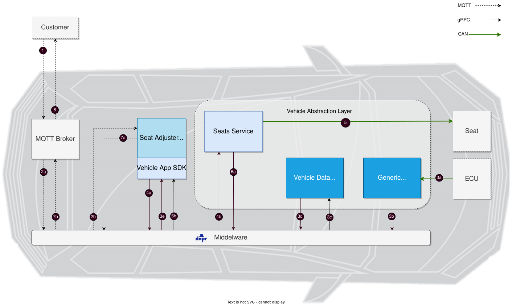
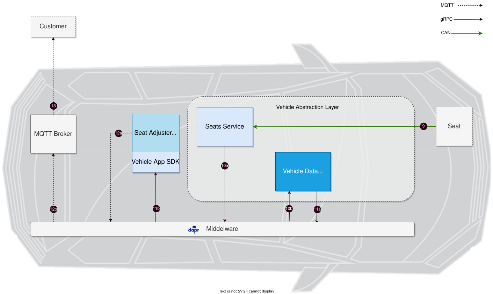

Imagine a car sharing company that wants to offer its customers the functionality that the driver seat automatically moves to the right position, when the driver enters the rented car. The car sharing company knows the driver and has stored the preferred seat position of the driver in its driver profile. The car gets unlocked by the driver and a request for the preferred seat position of the driver will be sent to the vehicle. That's where your implementation starts.
 
The _Seat Adjuster Vehicle App_ receives the seat position as an MQTT message and triggers a seat adjustment command of the _Seat Service_ that changes the seat position. Of course, the driver of a rented car would like the position, that he may have set himself, to be saved by the car sharing company and used for the next trip. As a result, the _Seat Adjuster Vehicle App_ subscribes to the seat position and receives the new seat position from the _Data Broker_ that streams the data from the _Seat Service_.

## Requesting new seat position



1. The **Customer** requests the change of the seat position as MQTT message on the topic `seatadjuster/setPosition/request` with the payload:
   ```json
   {"requestId": 42, "position": 300}
   ```
2. The **Seat Adjuster Vehicle App** that has subscribed to this topic, receives the request to change the seat position as a MQTT message.
3. The **Seat Adjuster Vehicle App** gets the current vehicle speed from the data broker, which is fed by the **CAN Feeder (KUKSA DBC Feeder)**.
4. With the support of the **Vehicle App SDK**, the **Seat Adjuster Vehicle App** triggers a seat adjustment command of the **Seat Service** via gRPC in the event that the speed is equal to zero. Hint: This is a helpful convenience check but not a safety check.
5. The **Seat Service** moves the seat to the new position via CAN messages.
6. The **Seat Service** returns OK or an error code as grpc status to the **Seat Adjuster Vehicle App**.
7. If everything went well, the **Seat Adjuster Vehicle App** returns a success message for the topic `seatadjuster/setPosition/response` with the payload:
   ```json
   {"requestId": 42, "status": 0 }
   ```
   Otherwise, an error message will be returned:
   ```json
   {"requestId": 42, "status": 1, "message": "<error message>" }
   ```
8. This success or error message will be returned to the **Customer**.

## Publishing current seat position



1. If the seat position will be changed by the driver, the new seat position will be sent to the **Seat Service** via CAN.
2.  The **Seat Service** streams the seat position via gRPC to the **KUKSA Data Broker** since it was registered beforehand.
3.  The **Seat Adjuster Vehicle App** that subscribed to the seat position receives the new seat position from the **KUKSA Data Broker** as a result.
12. The **Seat Adjuster Vehicle App** publishes this on topic `seatadjuster/currentPosition` with the payload:
    ```json
    {"position": 350}
    ```
13. The **Customer** who has subscribed to this topic retrieves the new seat position and can store this position to use it for the next trip.

## Example Code

You can find an example implementation of a Seat Adjuster vehicle application here:
[Seat Adjuster](https://github.com/eclipse-velocitas/vehicle-app-python-sdk/tree/main/examples/seat-adjuster)
