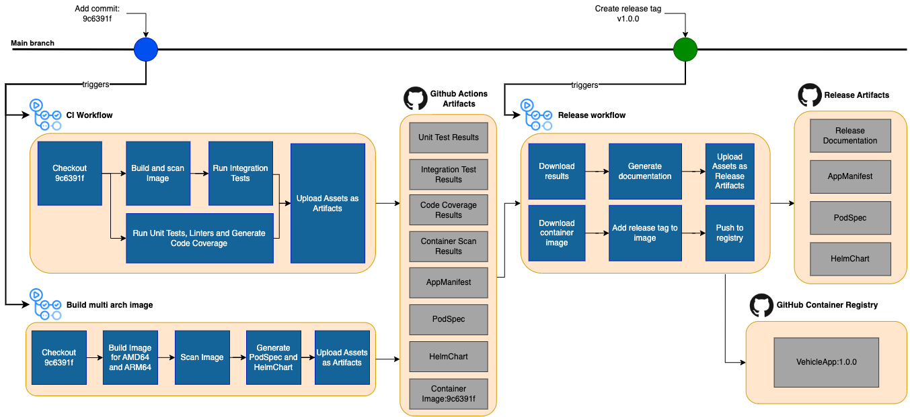

The Velocitas project provides a two-stage process for development, continuous integration, and release of a new version of a Vehicle App.

- **Stage 1 - Build & Test**
  On every new push to the `main` branch or every update to a pull request, a GitHub workflow is automatically executed to build your application as a container (optionally for different platforms), runs automated tests and code quality checks, and stores all results as GitHub artifacts for future reference with a [default retention period of 90 days](https://docs.github.com/en/organizations/managing-organization-settings/configuring-the-retention-period-for-github-actions-artifacts-and-logs-in-your-organization).

  The workflow provides quick feedback during development and improves efficient collaboration.

- **Stage 2 - Release**
  Once the application is ready to be released in a new version, a dedicated release workflow is automatically executed as soon as you create a new release via GitHub.

  The release workflow bundles all relevant images and artifacts into one tagged set of files and pushes it to the GitHub Container Registry. In addition, all the information needed for quality assurance and documentation are published as release artifacts on GitHub. The image pushed to the GitHub Container Registry can afterwards be deployed on your target system using the Over-The-Air (OTA) update system of your choice.

The drawing below illustrates the different workflows, actions and artifacts that are automatically created for you. All workflows are intended as a sensible baseline and can be extended and adapted to the needs of your own project.

## CI Workflow (ci.yml)

The `Continuous Integration (CI) workflow` is triggered on every commit to the main branch or when creating/updating a pull request and contains a set of actions to achieve the following objectives:

- **Building a container for the app** - actions create a containerized version of the Vehicle App.
- **Scanning for vulnerabilities** - actions scan your code and container for vulnerabilities and in case of findings the workflow will be marked as "failed".
- **Running integration tests** - actions provision a runtime instance and deploy all required services as containers together with your containerized application to allow for automatically executing integration test cases. In case the test cases fail, the workflow will be marked as "failed".
- **Running unit tests & code coverage** - actions run unit tests and calculate code coverage for your application, in case of errors or unsatisfactory code coverage, the workflow will be marked as "failed".
- **Storing scan & test results as GitHub action artifacts** - actions store results from the previously mentioned actions for further reference or download as Github Action Artifacts.

Check out the example GitHub workflows in our [repositories for python](https://github.com/eclipse-velocitas/vehicle-app-python-template/blob/main/.github/workflows/ci.yml)

## Build multi-arch image Workflow (build-multiarch-image.yml)

The `Build multi-arch image workflow` is triggered on every commit to the main branch and contains a set of actions to achieve the following objectives:

- **Building a multi-arch container for the app** - actions create a containerized version of the Vehicle App for multiple architectures (currently AMD64 and ARM64).
- **Scanning for vulnerabilities** - actions scan your code and container for vulnerabilities and in case of findings the workflow will be marked as "failed".
- **Storing container images to GitHub action artifacts** - at the end of the workflow, the container image created is stored in a Github Action Artifacts so that it can be referenced by the Release Workflow later.
- **Generate Deployment Files** - actions generate a PodSpec-file and HelmCharts to ease the deployment of the Vehicle App and the runtime services.

## Release Workflow (release.yml)

The `Release workflow` is triggered as soon as the `main` branch is ready for release and the Vehicle App developer creates a new GitHub release. This can be done manually through the GitHub UI.

On creating a new release with a specific new version, GitHub creates a tag and automatically runs the `Release workflow` defined in .github/workflows/release.yml, given that `CI workflow` has run successfully for the current commit on the main branch.

The set of actions included in the `Release workflow` cover the objective:

- **Generating and publishing QA information** - actions load the QA information from GitHub artifacts stored for the same commit reference and verify it. Additionally, release documentation is generated and added to the GitHub release. If there is no information available for the current commit, the release workflow will fail.
- **Publish as GitHub pages** - all information from the release together with the project documentation is built as a static page using hugo. The result is pushed to a separate branch and can be published as a GitHub page in your repository.
- **Pull & label container image** - actions pull the Vehicle App container image based on the current commit hash from the GitHub artifacts and label it with the specified tag version. If the image cannot be found, the workflow will fail.
- **Push container image to ghcr.io** - finally the labeled container image is pushed to the [GitHub container registry](ghcr.io) and can be used as a deployment source.

## GitHub Actions artifacts

**GitHub Actions artifacts** are used for storing data, which is generated by the `CI workflow` and referenced by the `Release workflow`. This saves time during workflow runs because we don't have to create artifacts multiple times.

GitHub Actions artifacts always have a retention period, which is 90 days by default. This may be configured differently in the specific GitHub organization. After this period, the QA info gets purged automatically. In this case, a re-run of the CI workflow would be required to regenerate all QA info needed for creating a release.

## Container Registry

The [GitHub container registry](ghcr.io) is used for storing container images pushed by the `Release workflow`. These images can easily be used for a deployment and don't have a retention period.
Since the registry does not have an automatic cleanup, it keeps container images as long as they are not deleted. It is recommended that you automate the removal of older images to limit storage size and costs.

## Versioning

Vehicle App image versions are set to the Git tag name during release. Though any versioning scheme can be adopted, the usage of [semantic versions](https://semver.org/) is recommended.

If the tag name contains a semantic version, the leading `v` will be trimmed.
**Example:** A tag name of `v1.0.0` will lead to version `1.0.0` of the Vehicle App container.

### Maintaining multiple versions

If there is a need to maintain multiple versions of a Vehicle App, e.g., to hotfix the production version while working on a new version at the same time or to support multiple versions in production, create and use `release branches`.

The release process would be the same as described in the overview, except that a release branch (e.g., `release/v1.0`) is created before the release step and the GitHub release is based on the `release` branch rather than the `main` branch. For hotfixes, release branches may be created retroactively from the release tag, if needed.

## Further information

- Tutorial: [How to write integration tests](/docs/tutorials/integration_tests)
- Tutorial: [Deploy a Vehicle App with Helm](/docs/tutorials/tutorial_how_to_deploy_a_vehicle_app_with_helm)
- Tutorial: [Deploy a Vehicle App with PodSpecs](/docs/tutorials/tutorial_how_to_deploy_a_vehicle_app_with_podspecs)
