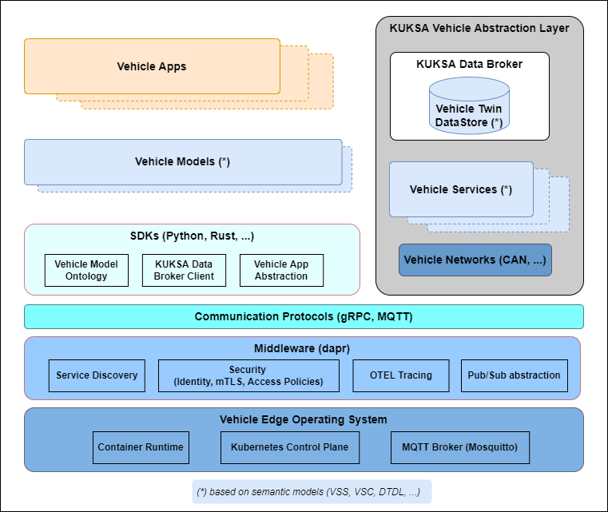
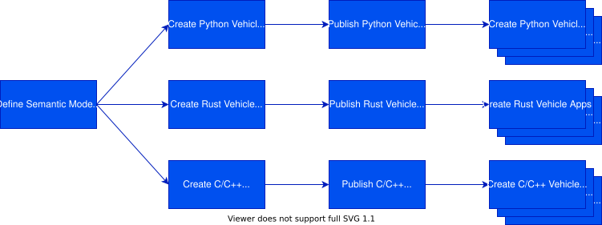

The Velocitas development model is centered around what are known as [_Vehicle Apps_](#vehicle-apps). Automation allows engineers to make high-impact changes frequently and deploy _Vehicle Apps_ through cloud backends as over-the-air updates. The _Vehicle App_ development model is about _speed_ and _agility_ paired with state-of-the-art software quality.

## Development Architecture

Velocitas provides a flexible development architecture for [_Vehicle Apps_](#vehicle-apps). The following diagram shows the major components of the Velocitas stack.

### Vehicle Apps

The Vehicle Applications (_Vehicle Apps_) contain the business logic that needs to be executed on a vehicle. A _Vehicle App_ is implemented on top of a [Vehicle Model](#vehicle-models) and its underlying language-specific [SDK](#sdks). Many concepts of cloud-native and [twelve-factor](https://12factor.net/) applications apply to _Vehicle Apps_ as well and are summarized in the next chapter.

### Vehicle Models

A Vehicle Model makes it possible to easily get vehicle data from the [Databroker](#kuksa-databroker) and to execute remote procedure calls over gRPC against [Vehicle Services](#vehicle-services) and other [_Vehicle Apps_](#vehicle-apps). It is generated from the underlying [semantic models](#semantic-models) for a concrete programming language as a graph-based, strongly-typed, intellisense-enabled library. The elements of the vehicle models are defined by the [SDKs](#sdks).

### SDKs

Our SDKs, available for different programming languages, are the foundation for the vehicle abstraction provided by the vehicle model Furthermore, they offer abstraction from the underlying middleware and communication protocols, besides providing the base classes and utilities for the _Vehicle Apps_.
SDKs are available for Python and C++, currently. Further SDKs for Rust and C are planned.

### Vehicle Services

Vehicle Services provide service interfaces to control actuators or to trigger (complex) actions. E.g. they communicate with the vehicle internal networks like CAN or Ethernet, which are connected to actuators, electronic control units (ECUs) and other vehicle computers (VCs). They may provide a simulation mode to run without a network interface. Vehicle services may feed data to the [Databroker](#kuksa-databroker) and may expose gRPC endpoints, which can be invoked by [_Vehicle Apps_](#vehicle-apps) over a [Vehicle Model](#vehicle-models).

### KUKSA Databroker

Vehicle data is stored in the KUKSA Databroker conforming to an underlying [Semantic Model](#semantic-models) like [VSS](https://covesa.github.io/vehicle_signal_specification/). [_Vehicle Apps_](#vehicle-apps) can either pull this data or subscribe for updates. In addition, it supports rule-based access to reduce the number of updates sent to the _Vehicle App_.

### Semantic models

The Vehicle Signal Specification ([VSS](https://covesa.github.io/vehicle_signal_specification/)) provides a domain taxonomy for vehicle signals and defines the vehicle data semantically, which is exchanged between _Vehicle Apps_ and the Databroker.

The Velocitas SDK is using [VSS](https://covesa.github.io/vehicle_signal_specification/) as the semantic model for the Vehicle Model.
Vehicle Service models can be defined with [Protobuf service definitions](vehicle_app_manifest/interfaces/grpc_interface/).

### Communication Protocols

Asynchronous communication between [_Vehicle Apps_](#vehicle-apps) and other vehicle components, as well as cloud connectivity, is facilitated through [MQTT](https://mqtt.org/) messaging. Direct, synchronous communication between [_Vehicle Apps_](#vehicle-apps), [Vehicle Services](#vehicle-services) and the [Databroker](#kuksa-databroker) is based on the [gRPC](https://grpc.io/) protocol.

### Middleware Abstraction

Velocitas basically provides middleware abstraction interfaces for service discovery, pubsub messaging, and other cross-cutting functionalites.
At the moment, Velocitas just offers a (what we call) "native middleware" implementation, which does not provide (gRPC) service discovery. Instead, addresses and port number of services need to be provided via environment variables to an app; e.g. SDV_VEHICLEDATABROKER_ADDRESS=grpc://localhost:55555.
The support of Dapr as middleware has recently been removed.

### Vehicle Edge Operating System

[_Vehicle Apps_](#vehicle-apps) are expected to run on a [Linux](https://www.linux.org/)-based operating system. An OCI-compliant container runtime is required to host the _Vehicle App_ containers. For publish/subscribe messaging a MQTT broker must be available (e.g., [Eclipse Mosquitto](https://mosquitto.org/)).

## _Vehicle App_ Characteristics

The following aspects are important characteristics for [_Vehicle Apps_](#vehicle-apps):

- **Code base:**
  Every _Vehicle App_ is stored in its own repository. Tracked by version control, it can be deployed to multiple environments.

- **Polyglot:**
  _Vehicle Apps_ can be written in any programming language. System-level programming languages like Rust and C/C++ are particularly relevant for limited hardware resources found in vehicles, but higher-level languages like Python and JavaScript are also considered for special use cases.

- **OCI-compliant containers:**
  _Vehicle Apps_ are deployed as OCI-compliant containers. The size of these containers should be minimal to fit on constrained devices.

- **Isolation:**
  Each _Vehicle App_ should execute in its own process and should be self-contained with its interfaces and functionality exposed on its own port.

- **Configurations:**
  Configuration information is separated from the code base of the _Vehicle App_, so that the same deployment can propagate across environments with their respective configuration applied.

- **Disposability:**
  Favor fast startup and support graceful shutdowns to leave the system in a correct state.

- **Observability:**
  _Vehicle Apps_ provide traces, metrics and logs of every part of the application using _Open Telemetry_.

- **Over-the-air update capability:**
  _Vehicle Apps_ can be deployed via cloud backends like [Pantaris](https://www.etas.com/en/products/pantaris-over-the-air-services.php) and updated in vehicles frequently over the air through [NextGen OTA updates](https://www.etas.com/en/support/webinars-nextgen-ota-updates-empowering-software-defined-vehicles-from-an-end-to-end-perspective.php).

## Development Process

The starting point for developing [_Vehicle Apps_](#vehicle-apps) is a [Semantic Model](#semantic-models) of the vehicle data and vehicle services. Based on the Semantic Model, language-specific [Vehicle Models](#vehicle-models) are generated. Vehicle Models are then distributed as packages to the respective package manager of the chosen programming language (e.g. pip, cargo, npm, ...).

After a Vehicle Model is available for the chosen programming language, the _Vehicle App_ can be developed using the generated Vehicle Model and its SDK.

## Further information
