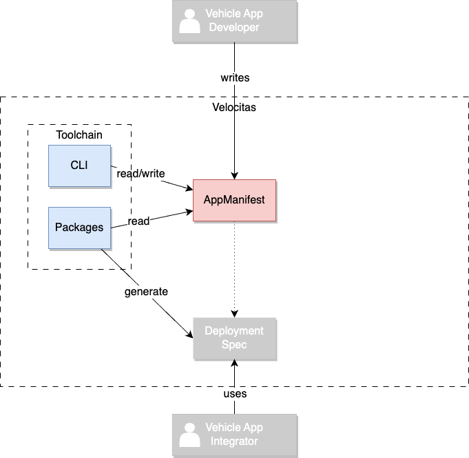
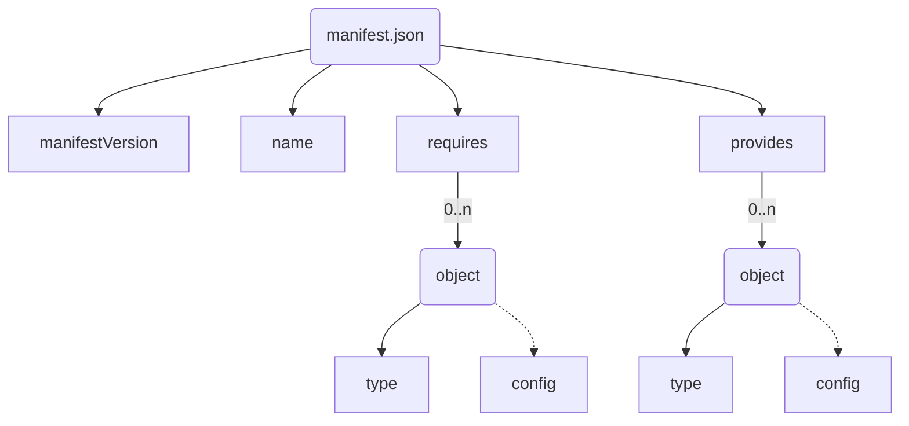

## Versions

* v1
* v2
* **v3 (current)**

## Introduction

The _AppManifest_ defines the properties of your _Vehicle App_ and its _functional interfaces_ (**FIs**).

**FIs** may be:

* required service interfaces (e.g. a required gRPC service interface)
* the used vehicle model and accessed data points.
* an arbitrary abstract interface description used by 3rd parties

In addition to _required_ **FIs**, _provided_ **FIs** can (and need) to be specified as well.

These defined interfaces are then used by the Velocitas toolchain to:

* generate service stubs for either a client implementation (required IF) or a server implementation (provided IF) (i.e. for gRPC)
* generate a source code equivalent of the defined vehicle model

## Overview

The image below depicts the interaction between _App Manifest_ and _DevEnv Configuration_ at -development time- The responsibilities are clearly separated; the _App Manifest_ describes the application and its interfaces whereas _DevEnv Configuration_ (or `.velocitas.json`) defines the configuration of the development environment and all the packages used by the Velocitas toolchain.



## Context

To fully understand the _AppManifest_, let's have a look at **who** interacts with it:



## Purpose

* Define the requirements of a _Vehicle App_ in an **abstract way** to avoid dependencies on concrete _Runtime_ and _Middleware_ configurations.
* Description of your applications **logical interfaces**(VehicleModel, services, APIs, ...)
* Enable **loose coupling** of logical interface descriptions and the Velocitas toolchain. Some parts of the toolchain are responsible for reading the file and acting upon it, depending on the type of logical interface
* Providing an **extendable** syntax to enable custom logical interface types which may not provided by the Velocitas toolchain itself, but by a third party
* Providing a **single source of truth** for generation of deployment specifications (i.e. Helm-Charts, Kanto spec, etc...)

## Example

```json
// AppManifest.json
{
  "manifestVersion": "v3",
  "name": "SampleApp",
  "requires": [
    {
        "type": "vehicle-model",
        "config": {
            "src": "https://github.com/COVESA/vehicle_signal_specification/releases/download/v3.0/vss_rel_3.0.json",
            "datapoints": [
                {
                    "path": "Vehicle.Speed",
                    "required": "true",
                    "access": "read"
                }
            ]
        }
    },
    {
        "type": "grpc-interface",
        "config": {
            "src": "https://raw.githubusercontent.com/eclipse/kuksa.val.services/main/seat_service/proto/sdv/edge/comfort/seats/v1/seats.proto"
        } 
    },
    {
        "type": "pubsub",
        "config": {
            "topics":  [ "SMART_WIPER_STATUS" ]
        }
    }
  ],
  "provides": []
}
```

The _VehicleApp_ above has a:

* required interface towards our generated Vehicle Model from the COVESA Vehicle Signal Specification. In particular it requires read access to the VSS data point `Vehicle.Speed`
* required interface towards a gRPC service who serves the `seats` service described within the `.proto` file
* required interface towards the `pubsub` middleware and is requesting read access to the topic `SMART_WIPER_STATUS`

The example has no provided interfaces.

## Structure

Refer to the [JSON Schema](https://json-schema.org/) of the current _AppManifest_ [here](./manifest.schema.v3.json).

### Visualization



### Logical interface types supported by Velocitas

Here is a list of logical interface types directly supported by the Velocitas toolchain and which Velocitas CLI packages are exposing the support:

* [Vehicle Model](./interfaces/vehicle_model/)
* [gRPC interface](./interfaces/grpc_interface/)
* [Publish and subscribe](./interfaces/pubsub/)

Support for additional interface types may be added by providing a 3rd party [CLI package](/docs/concepts/lifecycle_management/packages/).

### Planned, but not yet available features

Some FIs are dependent on used classes, methods or literals in your _Vehicle App_'s source code. For example the `vehicle-model` FI requires you to list required or provided datapoints. At the moment, these attributes need to be filled **manually**. There are ideas to auto-generate these attributes by analyzing the source code, but nothing is planned for that, yet.

## Further information

* Tutorial: [Quickstart](/docs/tutorials/quickstart.md)
* Tutorial: [Vehicle Model Creation](/docs/tutorials/vehicle_model_creation)
* Tutorial: [_Vehicle App_ Development](/docs/tutorials/vehicle_app_development)
* Concept: [Lifecycle Management](/docs/concepts/lifecycle_management)
