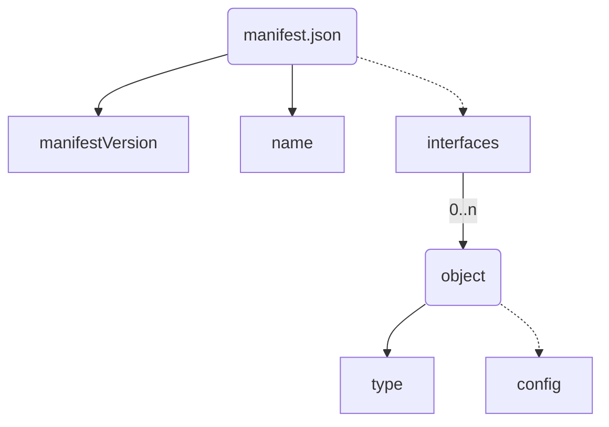

## Versions

* v1
* v2
* **v3 (current)**

## Introduction

The _AppManifest_ defines the properties of your _Vehicle App_ and its _functional interfaces_ (**FIs**).

**FIs** may be:

* required service interfaces (e.g. a required gRPC service interface)
* the used vehicle model and accessed data points.
* an arbitrary abstract interface description used by 3rd parties

In addition to _required_ **FIs**, _provided_ **FIs** can (and need) to be specified as well.

These defined interfaces are then used by the Velocitas toolchain to:

* generate service stubs for either a client implementation (required IF) or a server implementation (provided IF) (i.e. for gRPC)
* generate a source code equivalent of the defined vehicle model

## Overview

The image below depicts the interaction between _App Manifest_ and _DevEnv Configuration_ at -development time- The responsibilities are clearly separated; the _App Manifest_ describes the application and its interfaces whereas _DevEnv Configuration_ (or `.velocitas.json`) defines the configuration of the development environment and all the packages used by the Velocitas toolchain.


## Context

To fully understand the _AppManifest_, let's have a look at **who** interacts with it:


## Purpose

* Define the requirements of a _Vehicle App_ in an **abstract way** to avoid dependencies on concrete _Runtime_ and _Middleware_ configurations.
* Description of your applications **functional interfaces**(VehicleModel, services, APIs, ...)
* Enable **loose coupling** of functional interface descriptions and the Velocitas toolchain. Some parts of the toolchain are responsible for reading the file and acting upon it, depending on the type of functional interface
* Providing an **extendable** syntax to enable custom functional interface types which may not provided by the Velocitas toolchain itself, but by a third party
* Providing a **single source of truth** for generation of deployment specifications (i.e. Helm-Charts, Kanto spec, etc...)

## Example

```json
// AppManifest.json
{
  "manifestVersion": "v3",
  "name": "SampleApp",
  "interfaces": [
    {
        "type": "vehicle-signal-interface",
        "config": {
            "src": "https://github.com/COVESA/vehicle_signal_specification/releases/download/v3.0/vss_rel_3.0.json",
            "datapoints": {
                "required": [
                    {
                        "path": "Vehicle.Speed",
                        "optional": "true",
                        "access": "read",
                    }
                ],
                "provided": [
                    {
                        "path": "Vehicle.Cabin.Seat.Row1.Pos1.Position",
                    }
                ]
            }
        }
    },
    {
        "type": "grpc-interface",
        "config": {
            "src": "https://raw.githubusercontent.com/eclipse/kuksa.val.services/main/seat_service/proto/sdv/edge/comfort/seats/v1/seats.proto",
            "direction": "required",
        } 
    },
    {
        "type": "pubsub",
        "config": {
            "reads":  [ "sampleapp/getSpeed" ],
            "writes": [ "sampleapp/currentSpeed", "sampleapp/getSpeed/response" ]
        }
    }
}
```

The _VehicleApp_ above has an:

* interface towards our generated Vehicle Signal Interface based on the [COVESA Vehicle Signal Specification](https://github.com/COVESA/vehicle_signal_specification). In particular, it requires read access to the vehicle signal `Vehicle.Speed` since the signal is marked as _optional_ the application will work, even if the signal is not present in the system. Additionally, the application acts as a provider for the signal `Vehicle.Cabin.Seat.Row1.Pos1.Position` meaning that it will take responsibility of reading/writing data directly to vehicle networks for the respective signal.

* interface towards gRPC based on the `seats.proto` file. Since the `direction` is `required` a service client for the `seats` service will be generated who interacts with the Velocitas middleware.

* interface towards the `pubsub` middleware and is reading to the topic `sampleapp/getSpeed` and writing the topics `sampleapp/currentSpeed`, `sampleapp/getSpeed/response`.

The example has no provided interfaces.

## Structure

Describes all external properties and interfaces of a Vehicle Application.

### Properties


| Property          | Type                    | Required | Description                                              |
|-------------------|-------------------------|----------|----------------------------------------------------------|
| `manifestVersion` | string                  | **Yes**  | The version of the App Manifest.                         |
| `name`            | string                  | **Yes**  | The name of the Vehicle Application.                     |
| `interfaces`      | [object](#interfaces)[] | No       | Array of all provided or required functional interfaces. |


### interfaces

#### Properties


| Property | Type              | Required | Description                                                                             |
|----------|-------------------|----------|-----------------------------------------------------------------------------------------|
| `type`   | string            | **Yes**  | The type of the functional interface.                                                   |
| `config` | [object](#config) | No       | The configuration of the functional interface type. Content may vary between all types. |



#### config

The configuration of the functional interface type. Content may vary between all types.

Refer to the [JSON Schema](https://json-schema.org/) of the current _AppManifest_ [here](./manifest.v3.schema.json).

### Visualization



### Functional interface types supported by Velocitas

Here is a list of functional interface types directly supported by the Velocitas toolchain and which Velocitas CLI packages are exposing the support:

* [Vehicle Model](./interfaces/vehicle_model/)
* [gRPC interface](./interfaces/grpc_interface/)
* [Publish and subscribe](./interfaces/pubsub/)

Support for additional interface types may be added by providing a 3rd party [CLI package](/docs/concepts/lifecycle_management/packages/).

## Planned, but not yet available features

Some FIs are dependent on used classes, methods or literals in your _Vehicle App_'s source code. For example the `vehicle-model` FI requires you to list required or provided datapoints. At the moment, these attributes need to be filled **manually**. There are ideas to auto-generate these attributes by analyzing the source code, but nothing is planned for that, yet.

## Further information

* Tutorial: [Quickstart](/docs/tutorials/quickstart.md)
* Tutorial: [Vehicle Model Creation](/docs/tutorials/vehicle_model_creation)
* Tutorial: [_Vehicle App_ Development](/docs/tutorials/vehicle_app_development)
* Concept: [Lifecycle Management](/docs/concepts/lifecycle_management)
