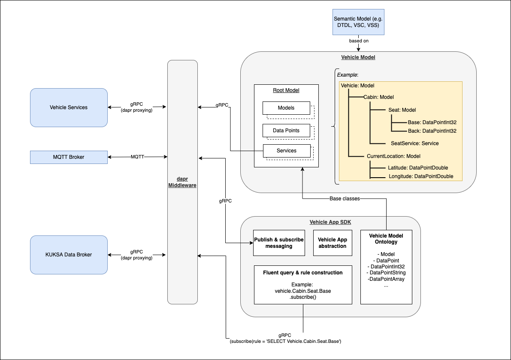

## Introduction

The _Vehicle App_ SDK consists of the following building blocks:

- **[Vehicle Model Ontology](#vehicle-model-ontology):** The SDK provides a set of model base classes for the creation of vehicle models.

- **[Middleware integration](#middleware-integration):** Vehicle Models can contain gRPC stubs to communicate with _Vehicle Services_. gRPC communication is integrated natively.

- **[Fluent query & rule construction](#fluent-query--rule-construction):** Based on a concrete Vehicle Model, the SDK is able to generate queries and rules against the KUKSA Databroker to access the real values of the data points that are defined in the vehicle model.

- **[Publish & subscribe messaging](#publish--subscribe-messaging):** The SDK supports publishing messages to a MQTT broker and subscribing to topics of a MQTT broker.

- **[Vehicle App abstraction](#vehicle-app-abstraction):** Last but not least the SDK provides a `VehicleApp` base class, which every _Vehicle App_ derives from.

An overview of the _Vehicle App_ SDK and its dependencies is depicted in the following diagram:

## Vehicle Model Ontology

The Vehicle Model is a tree-based model where every branch in the tree, including the root, is derived from the `Model` base class provided by the SDK.

The Vehicle Model Ontology consists of the following classes:

### Model

A model contains data points (leaves) and other models (branches).

### ModelCollection

{}
The ModelCollection is deprecated since SDK v0.4.0. The generated vehicle model must reflect the actual representation of the data points. Please use the _Model_ base class instead.
{}

Specifications like VSS support a concept that is called [Instances](https://covesa.github.io/vehicle_signal_specification/rule_set/instances/). It makes it possible to describe repeating definitions. In DTDL, such kind of structures may be modeled with [Relationships](https://github.com/Azure/opendigitaltwins-dtdl/blob/master/DTDL/v2/DTDL.v2.md#relationship). In the SDK, these structures are mapped with the `ModelCollection` class. A `ModelCollection` is a collection of models, which make it possible to reference an individual model either by a `NamedRange` (e.g., Row [1-3]), a `Dictionary` (e.g., "Left", "Right") or a combination of both.

### Service

Direct asynchronous communication between _Vehicle Apps_ and _Vehicle Services_ is facilitated via the [gRPC](https://grpc.io) protocol.

The SDK has its own `Service` base class, which provides a convenience API layer to access the exposed methods of exactly one gRPC endpoint of a _Vehicle Service_ or another _Vehicle App_. Please see the [Middleware Integration](#middleware-integration) section for more details.

### DataPoint

`DataPoint` is the base class for all data points. It corresponds to sensors/actuators/attributes in VSS or telemetry/properties in DTDL.

Data points are the signals that are typically emitted by _Vehicle Services_ or _Data Providers_.

The representation of a data point is a path starting with the root model, e.g.:

- `Vehicle.Speed`
- `Vehicle.FuelLevel`
- `Vehicle.Cabin.Seat.Row1.Pos1.Position`

Data points are defined as attributes of the model classes. The attribute name is the name of the data point without its path.

### Typed DataPoint classes

Every primitive datatype has a corresponding typed data point class, which is derived from `DataPoint` (e.g., `DataPointInt32`, `DataPointFloat`, `DataPointBool`, `DataPointString`, etc.).

### Example

An example of a Vehicle Model created with the described ontology is shown below:




## import ontology classes

from sdv import (
    DataPointDouble,
    Model,
    Service,
    DataPointInt32,
    DataPointBool,
    DataPointArray,
    DataPointString,
)

class Seat(Model):
    def __init__(self, name, parent):
        super().__init__(parent)
        self.name = name
        self.Position = DataPointBool("Position", self)
        self.IsOccupied = DataPointBool("IsOccupied", self)
        self.IsBelted = DataPointBool("IsBelted", self)
        self.Height = DataPointInt32("Height", self)
        self.Recline = DataPointInt32("Recline", self)

class Cabin(Model):
    def __init__(self, name, parent):
        super().__init__(parent)
        self.name = name
        self.DriverPosition = DataPointInt32("DriverPosition", self)
        self.Seat = SeatCollection("Seat", self)

class SeatCollection(Model):
    def __init__(self, name, parent):
        super().__init__(parent)
        self.name = name
        self.Row1 = self.RowType("Row1", self)
        self.Row2 = self.RowType("Row2", self)

    def Row(self, index: int):
        if index < 1 or index > 2:
            raise IndexError(f"Index {index} is out of range")
        _options = {
            1 : self.Row1,
            2 : self.Row2,
        }
        return _options.get(index)

    class RowType(Model):
        def __init__(self, name, parent):
            super().__init__(parent)
            self.name = name
            self.Pos1 = Seat("Pos1", self)
            self.Pos2 = Seat("Pos2", self)
            self.Pos3 = Seat("Pos3", self)

        def Pos(self, index: int):
            if index < 1 or index > 3:
                raise IndexError(f"Index {index} is out of range")
            _options = {
                1 : self.Pos1,
                2 : self.Pos2,
                3 : self.Pos3,
            }
            return _options.get(index)

class VehicleIdentification(Model):
    def __init__(self, name, parent):
        super().__init__(parent)
        self.name = name
        self.VIN = DataPointString("VIN", self)
        self.Model = DataPointString("Model", self)

class CurrentLocation(Model):
    def __init__(self, name, parent):
        super().__init__(parent)
        self.name = name
        self.Latitude = DataPointDouble("Latitude", self)
        self.Longitude = DataPointDouble("Longitude", self)
        self.Timestamp = DataPointString("Timestamp", self)
        self.Altitude = DataPointDouble("Altitude", self)

class Vehicle(Model):
    def __init__(self, name, parent):
        super().__init__(parent)
        self.name = name
        self.Speed = DataPointFloat("Speed", self)
        self.CurrentLocation = CurrentLocation("CurrentLocation", self)
        self.Cabin = Cabin("Cabin", self)

vehicle = Vehicle("Vehicle")




#include "sdk/DataPoint.h"

#include "sdk/Model.h"

using namespace velocitas;

class Seat : public Model {
public:
  Seat(std::string name, Model* parent)
      : Model(name, parent) {}

  DataPointBoolean Position{"Position", this};
  DataPointBoolean IsOccupied{"IsOccupied", this};
  DataPointBoolean IsBelted{"IsBelted", this};
  DataPointInt32 Height{"Height", this};
  DataPointInt32 Recline{"Recline", this};
};

class CurrentLocation : public Model {
public:
  CurrentLocation(Model* parent)
      : Model("CurrentLocation", parent) {}

  DataPointDouble Latitude{"Latitude", this};
  DataPointDouble Longitude{"Longitude", this};
  DataPointString Timestamp{"Timestamp", this};
  DataPointDouble Altitude{"Altitude", this};
};

class Cabin : public Model {
public:
  class SeatCollection : public Model {
  public:
    class RowType : public Model {
    public:
      using Model::Model;

      Seat Pos1{"Pos1", this};
      Seat Pos2{"Pos2", this};
    };

    SeatCollection(Model* parent)
        : Model("Seat", parent) {}

    RowType Row1{"Row1", this};
    RowType Row2{"Row2", this};
  };

  Cabin(Model* parent)
      : Model("Cabin", parent) {}

  DataPointInt32 DriverPosition{"DriverPosition", this};
  SeatCollection Seat{this};
};

class Vehicle : public Model {
public:
  Vehicle()
      : Model("Vehicle") {}

  DataPointFloat Speed{"Speed", this};
  ::CurrentLocation CurrentLocation{this};
  ::Cabin Cabin{this};
};




## Middleware integration

### gRPC Services

_Vehicle Services_ are expected to expose their public endpoints over the gRPC protocol. The related protobuf definitions are used to generate method stubs for the Vehicle Model to make it possible to call the methods of the _Vehicle Services_.

### Model integration

{}
Please be aware that the integration of _Vehicle Services_ into the overall model is not supported by [automated model lifecycle](/docs/tutorials/vehicle_model_creation/automated_model_lifecycle/), currently.
{}

Based on the `.proto` files of the _Vehicle Services_, the protocol buffer compiler generates descriptors for all rpcs, messages, fields etc. for the target language.
The gRPC stubs are wrapped by a **convenience layer** class derived from `Service` that contains all the methods of the underlying protocol buffer specification.

{}
The convenience layer of C++ is a bit more extensive than in Python. The complexity of gRPC's async API is hidden behind individual `AsyncGrpcFacade` implementations which need to be implemented manually. Have a look at the `SeatService` of the `SeatAdjusterApp` example and its `SeatServiceAsyncGrpcFacade`.
{}




class SeatService(Service):
    def __init__(self):
        super().__init__()
        self._stub = SeatsStub(self.channel)

    async def Move(self, seat: Seat):
        response = await self._stub.Move(
            MoveRequest(seat=seat), metadata=self.metadata
        )
        return response




class SeatService : public Service {
public:
    // nested classes/structs omitted

    SeatService(Model* parent)
        : Service("SeatService", parent)
        , m_asyncGrpcFacade(grpc::CreateChannel("localhost:50051", grpc::InsecureChannelCredentials()))
    {
    }

    AsyncResultPtr_t<VoidResult> move(Seat seat)
    {
        auto asyncResult = std::make_shared<AsyncResult<VoidResult>>();

        m_asyncGrpcFacade->Move(
            toGrpcSeat(seat),
            [asyncResult](const auto& reply){ asyncResult->insertResult(VoidResult{})}),
            [asyncResult](const auto& status){ asyncResult->insertError(toInternalStatus(status))};

        return asyncResult;
    }

private:
    std::shared_ptr<SeatServiceAsyncGrpcFacade> m_asyncGrpcFacade;
};




## Fluent query & rule construction

A set of query methods like `get()`, `where()`, `join()` etc. are provided through the `Model` and `DataPoint` base classes. These functions make it possible to construct SQL-like queries and subscriptions in a fluent language, which are then transmitted through the gRPC interface to the KUKSA Databroker.

### Query examples

The following examples show you how to query data points.

#### Get single data point



driver_pos: int = vehicle.Cabin.DriverPosition.get()

# Call to broker

# GetDataPoint(rule="SELECT Vehicle.Cabin.DriverPosition")



auto driverPos = getDataPoints({Vehicle.Cabin.DriverPosition})->await();

// Call to broker:
// GetDataPoint(rule="SELECT Vehicle.Cabin.DriverPosition")



#### Get data points from multiple branches


  
vehicle_data = vehicle.CurrentLocation.Latitude.join(
    vehicle.CurrentLocation.Longitude).get()

print(f'
    Latitude: {vehicle_data.CurrentLocation.Latitude}
    Longitude: {vehicle_data.CurrentLocation.Longitude}
    ')

# Call to broker

# GetDataPoint(rule="SELECT Vehicle.CurrentLocation.Latitude, CurrentLocation.Longitude")



  auto datapoints =
      getDataPoints({Vehicle.CurrentLocation.Latitude, Vehicle.CurrentLocation.Longitude})->await();

// Call to broker:
// GetDataPoint(rule="SELECT Vehicle.CurrentLocation.Latitude, CurrentLocation.Longitude")



### Subscription examples

#### Subscribe and Unsubscribe to a single data point


  
self.rule = (
    await self.vehicle.Cabin.Seat.Row(2).Pos(1).Position
    .subscribe(self.on_seat_position_change)
)

def on_seat_position_change(self, data: DataPointReply):
    position = data.get(self.vehicle.Cabin.Seat.Row2.Pos1.Position).value
    print(f'Seat position changed to {position}')

# Call to broker

# Subscribe(rule="SELECT Vehicle.Cabin.Seat.Row2.Pos1.Position")

# If needed, the subscription can be stopped like this

await self.rule.subscription.unsubscribe()


auto subscription =
    subscribeDataPoints(
        velocitas::QueryBuilder::select(Vehicle.Cabin.Seat.Row(2).Pos(1).Position).build())
        ->onItem(
            [this](auto&& item) { onSeatPositionChanged(std::forward<decltype(item)>(item)); });

// If needed, the subscription can be stopped like this:
subscription->cancel();

void onSeatPositionChanged(const DataPointMap_t datapoints) {
    logger().info("SeatPosition has changed to: "+ datapoints.at(Vehicle.Cabin.Seat.Row(2).Pos(1).Position)->asFloat().get());
}



#### Subscribe to a single data point with a filter



Vehicle.Cabin.Seat.Row(2).Pos(1).Position.where(
    "Cabin.Seat.Row2.Pos1.Position > 50")
    .subscribe(on_seat_position_change)

def on_seat_position_change(data: DataPointReply):
    position = data.get(Vehicle.Cabin.Seat.Row2.Pos1.Position).value
    print(f'Seat position changed to {position}')

# Call to broker

# Subscribe(rule="SELECT Vehicle.Cabin.Seat.Row2.Pos1.Position WHERE Vehicle.Cabin.Seat.Row2.Pos1.Position > 50")



auto query = QueryBuilder::select(Vehicle.Cabin.Seat.Row(2).Pos(1).Position)
    .where(vehicle.Cabin.Seat.Row(2).Pos(1).Position)
    .gt(50)
    .build();

subscribeDataPoints(query)->onItem([this](auto&& item){onSeatPositionChanged(std::forward<decltype(item)>(item));}));

void onSeatPositionChanged(const DataPointMap_t datapoints) {
    logger().info("SeatPosition has changed to: "+ datapoints.at(Vehicle.Cabin.Seat.Row(2).Pos(1).Position)->asFloat().get());
}
// Call to broker:
// Subscribe(rule="SELECT Vehicle.Cabin.Seat.Row2.Pos1.Position WHERE Vehicle.Cabin.Seat.Row2.Pos1.Position > 50")



## Publish & subscribe messaging

The SDK supports publishing messages to a MQTT broker and subscribing to topics of a MQTT broker. Using the Velocitas SDK, the low-level MQTT communication is abstracted away from the _Vehicle App_ developer. Especially the physical address and port of the MQTT broker is no longer configured in the _Vehicle App_ itself, but rather is set as an environment variable, which is outside of the _Vehicle App_.

### Publish MQTT Messages

MQTT messages can be published easily with the `publish_event()` method, inherited from `VehicleApp` base class:



await self.publish_event(
    "seatadjuster/currentPosition", json.dumps(req_data))


publishToTopic("seatadjuster/currentPosition", "{ \"position\": 40 }");



### Subscribe to MQTT Topics

In Python subscriptions to MQTT topics can be easily established with the `subscribe_topic()` annotation. The annotation needs to be applied to a method of the `VehicleApp` base class. In C++ the `subscribeToTopic()` method has to be called. Callbacks for `onItem` and `onError` can be set. The following examples provide some more details.



@subscribe_topic("seatadjuster/setPosition/request")
async def on_set_position_request_received(self, data: str) -> None:
    data = json.loads(data)
    logger.info("Set Position Request received: data=%s", data)



#include <fmt/core.h>

#include <nlohmann/json.hpp>

subscribeToTopic("seatadjuster/setPosition/request")->onItem([this](auto&& item){
    const auto jsonData = nlohmann::json::parse(item);
    logger().info(fmt::format("Set Position Request received: data={}", jsonData));
});



## Vehicle App abstraction

_Vehicle Apps_ are inherited from the `VehicleApp` base class. This enables the _Vehicle App_ to use the Publish & Subscribe messaging and to connect to the KUKSA Databroker.

The `Vehicle Model` instance is passed to the constructor of the `VehicleApp` class and should be stored in a member variable (e.g. `self.vehicle` for Python, `std::shared_ptr<Vehicle> m_vehicle;` for C++), to be used by all methods within the application.

Finally, the `run()` method of the `VehicleApp` class is called to start the _Vehicle App_ and register all MQTT topic and Databroker subscriptions.

{}
In Python, the subscriptions are based on `asyncio`, which makes it necessary to call the `run()` method with an active `asyncio event_loop`.
{}

A typical skeleton of a _Vehicle App_ looks like this:



class SeatAdjusterApp(VehicleApp):
    def __init__(self, vehicle: Vehicle):
        super().__init__()
        self.vehicle = vehicle

async def main():
    # Main function
    logger.info("Starting seat adjuster app...")
    seat_adjuster_app = SeatAdjusterApp(vehicle)
    await seat_adjuster_app.run()

LOOP = asyncio.get_event_loop()
LOOP.add_signal_handler(signal.SIGTERM, LOOP.stop)
LOOP.run_until_complete(main())
LOOP.close()



#include "sdk/VehicleApp.h"

#include "vehicle/Vehicle.hpp"

using namespace velocitas;

class SeatAdjusterApp : public VehicleApp {
public:
    SeatAdjusterApp()
        : VehicleApp(IVehicleDataBrokerClient::createInstance("vehicledatabroker")),
        IPubSubClient::createInstance("localhost:1883", "SeatAdjusterApp"))
    {}
private:
    ::Vehicle Vehicle;
};

int main(int argc, char** argv) {
    SeatAdjusterApp app;
    app.run();
    return 0;
}



## Further information

- Tutorial: [Quickstart](/docs/tutorials/quickstart.md)
- Tutorial: [Vehicle Model Creation](/docs/tutorials/vehicle_model_creation)
- Tutorial: [_Vehicle App_ Development](/docs/tutorials/vehicle_app_development)
- Tutorial: [Develop and run integration tests for a _Vehicle App_](/docs/tutorials/vehicle_app_development/integration_tests)
