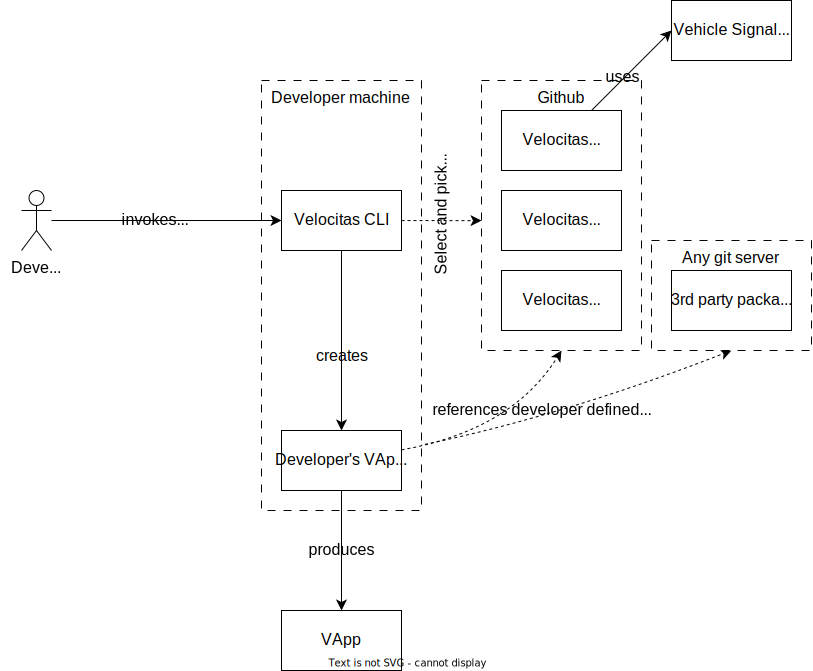

To be filled.

#### Template based creation flow


#### Bootstrapping creation flow



#### Resulting Velocitas CLI and Velocitas Package changes

* `velocitas create` command shall be introduced
  * it will guide through the project creation process, allowing the developer to add APIs and services at creation time which will reference the correct Velocitas CLI packages (either provided by Velocitas or by a 3rd party).
  * in addition to an interactive mode where create is invoked without arguments, there shall be a CLI mode where all of the arguments shall be passable as arguments

* Packages need to be available in a central registry (i.e. a new git repository) otherwise step 3 (depicted below) is not possible.

* Packages need to expose which dependency types they are providing in their manifest. For each dependency type a human readable name for the type shall be exposed.

## Interaction mockup

```bash
> velocitas create
... Creating a new Velocitas project!
> What is the name of your project?
MyApp

> 1. Which programming language would you like to use for your project?
[ ] Python
[x] C++

> 2. Which integrations would you like to use? (multiple selections possible)
[x] Github
[x] Gitlab
[ ] Gitee

> 3. Which API dependencies does your project have?
[x] gRPC service
[ ] uProtocol service
[x] Vehicle Service Catalogue

> 4. Add an API dependency (y/n)?
y

> 5. What type of dependency?
[x] gRPC-IF
[ ] VSC-IF

> 6. URI of the .proto file?
https://some-url/if.proto

> 7. Add an(other) API dependency (y/n)?
n

... Project created!
```

*Arguments mockup:*

```bash

$ velocitas create \
    --name MyApp \
    --lang cpp \
    --package grpc-service-support \
    --package vsc-support \
    --require grpc-interface:https://some-url/if.proto

> Project created!
```
