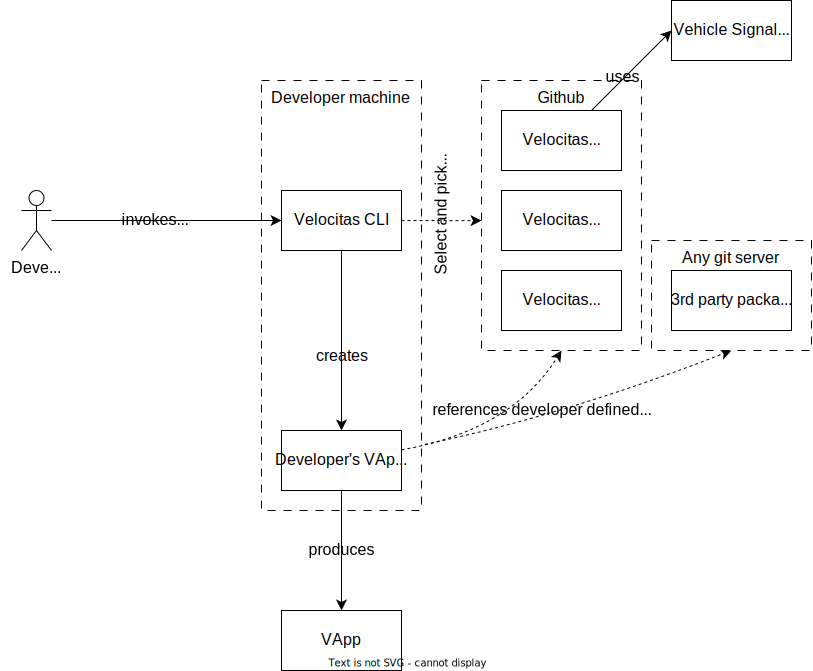
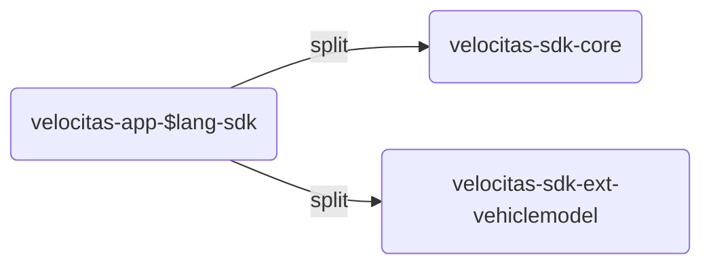
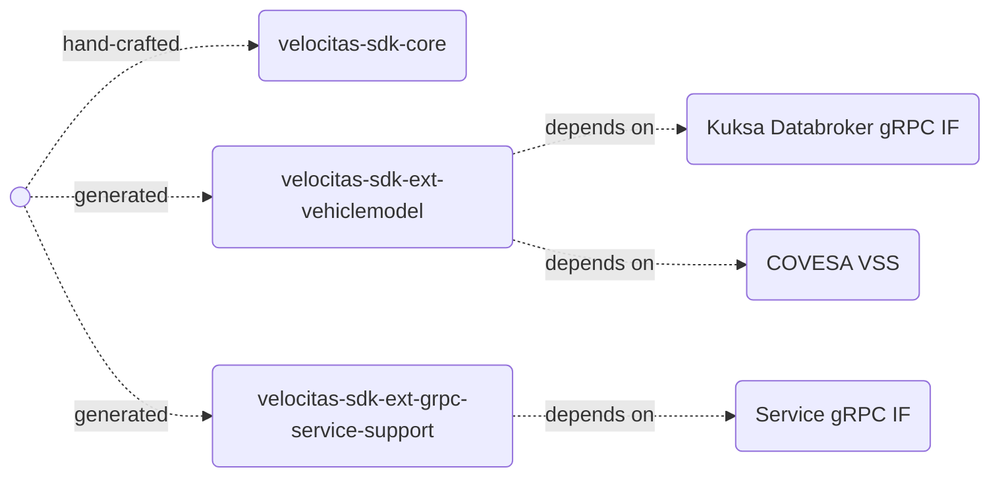
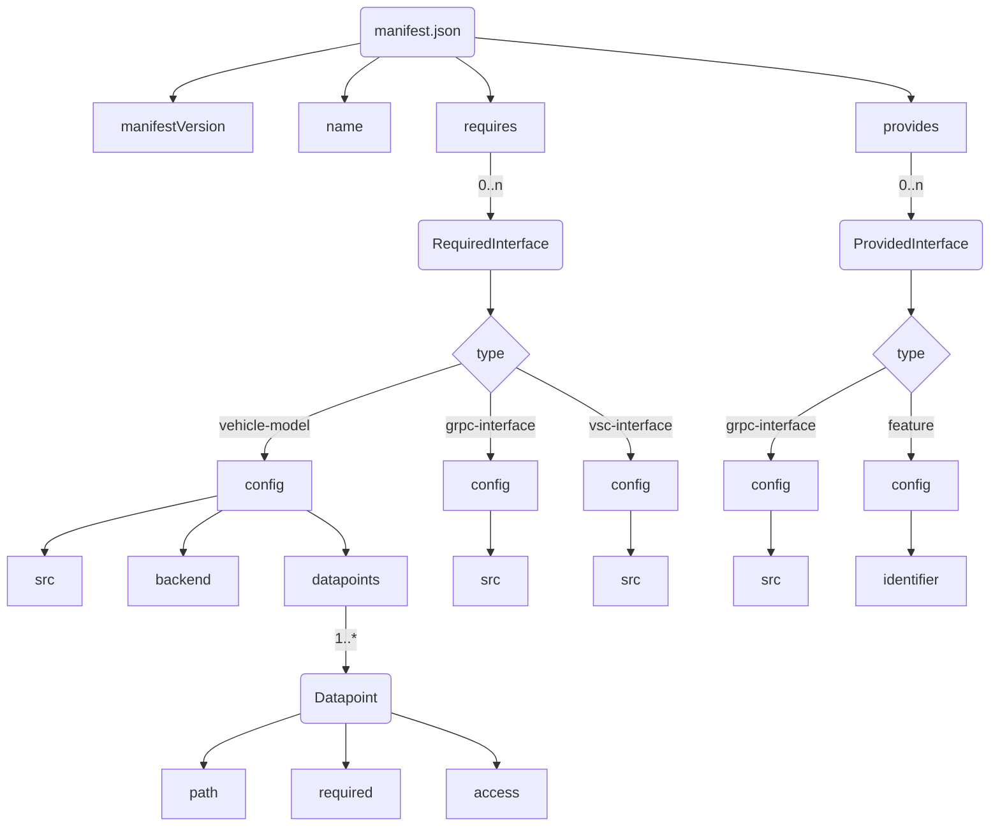

## Versions

* v1
* [v2](concepts/development_model/vehicle_app_manifest/)
* **v3 (latest)**

## Version 3

Version 2 of the manifest was strongly coupled to the usage of the [Vehicle Signal Specification](https://github.com/COVESA/vehicle_signal_specification). We got feedback that while this is good for simple applications, there is definitely the need for remote procedure calls via user provided interfaces or even fully custom API archives.

Furthermore, we want to extend Velocitas to not only be the toolchain for Vehicle App development but also for it to be the toolchain for Vehicle Service development.

### Design Goals

* Allow description of dependencies on services (technology agnostic) via contracts
* Make dependency on KUKSA Databroker and VSS optional
* Support creation of vehicle services in addition to vehicle apps

### Requirements

* uProtocol services can be integrated
* COVESA Vehicle Service Catalogue can be integrated
* ... other 3rd party APIs can be integrated
* Velocitas allows creation of vehicle apps and services
* VSS models shall still be usable with minor modification

### Change 1: Adaption of project creation flow

To support configurability on which services and APIs shall be used, we need to rework the way a Vehicle App project is created. At the moment it is very static and supports only our provided Vehicle Model (generated from a user-defined VSS source file).

Therefore we need a flexible and interactive selection of services/APIs upon project creation. This can be achieved either by:

1. a Github workflow with parameters,
2. a whole new tool which handles project creation, or
3. a new CLI command to bootstrap a project.

Firstly, a Github workflow has a fixed number of parameters and cannot be interactive.

Secondly, a new tool would mean additional maintenance effort on yet another SW project which reads and writes files already under control by the CLI.

Therefore, we have settled on introducing a new CLI command since it already handles all files to be read and modified and is responsible for the lifecycle of the project; creation is just another phase in the lifecycle.

#### Old creation flow


#### New creation flow



<image new>

#### Resulting Velocitas CLI and Velocitas Package changes

* `velocitas create` command shall be introduced [see concept here](concepts/lifecycle_management/create)
  * it will guide through the project creation process, allowing the developer to add APIs and services at creation time which will reference the correct Velocitas CLI packages (either provided by Velocitas or by a 3rd party).
  * in addition to an interactive mode where create is invoked without arguments, there shall be a CLI mode where all of the arguments shall be passable as arguments

* Packages need to be available in a central registry (i.e. a new git repository) otherwise step 3 (depicted below) is not possible.

* Packages need to expose which dependency types they are providing in their manifest. For each dependency type a human readable name for the type shall be exposed.

*Arguments mockup:*

```bash

$ velocitas create \
    --name MyApp \
    --lang cpp \
    --package grpc-service-support \
    --package vsc-support \
    --require grpc-interface:https://some-url/if.proto

> Project created!
```

### Change 2: Vehicle App SDK restructuring

#### Definitions

* `velocitas-sdk-core` - The core SDK provided by Velocitas, currently known as `vehicle-app-python-sdk` and `vehicle-app-cpp-sdk`
* `velocitas-sdk-ext` - Extension SDKs which rely on the `velocitas-core-sdk` but provide additional functionality, depending on the specific use-case

#### Changes

The SDKs need to be split in order to contain only source code relevant to the dependencies they have chosen in the app manifest. Therefore, since VSS (and therefore the vehicle model) is optional, the vehicle model enabling classes shall be moved into a separate SDK extension module.



New modules for Velocitas SDK:



### Change 3: Manifest changes

* To reflect the ability to create apps and services, `AppManifest.json` shall be renamed to `manifest.json`.

* To weaken the dependency to VSS, the `vehicleModel` attribute shall be removed and the content shall be moved to a newly introduced dependency type `vehicle-model`.

* Dependencies to services and other APIs shall be declared as dependency with a type identifier which allows the corresponding generators to pick them up and create SDK extensions out of the information (which may either be a URI to a service IF or an archive).

#### Schema

```json
{
  "$schema": "http://json-schema.org/draft-04/schema#",
  "type": "object",
  "properties": {
    "manifestVersion": {
      "type": "string"
    },
    "name": {
      "type": "string"
    },
    "requires": {
      "type": "array",
      "items": [
        {
          "type": "object",
          "properties": {
            "type": {
              "type": "string"
            },
            "config": {
              "type": "object",
              "properties": {
                "src": {
                  "type": "string"
                },
                "datapoints": {
                  "type": "array",
                  "items": [
                    {
                      "type": "object",
                      "properties": {
                        "path": {
                          "type": "string"
                        },
                        "required": {
                          "type": "string"
                        },
                        "access": {
                          "type": "string"
                        }
                      },
                      "required": [
                        "path",
                        "required",
                        "access"
                      ]
                    }
                  ]
                }
              },
              "required": [
                "src",
                "datapoints"
              ]
            }
          },
          "required": [
            "type",
            "config"
          ]
        },
        {
          "type": "object",
          "properties": {
            "type": {
              "type": "string"
            },
            "config": {
              "type": "object",
              "properties": {
                "src": {
                  "type": "string"
                }
              },
              "required": [
                "src"
              ]
            }
          },
          "required": [
            "type",
            "config"
          ]
        },
        {
          "type": "object",
          "properties": {
            "type": {
              "type": "string"
            },
            "config": {
              "type": "object",
              "properties": {
                "src": {
                  "type": "string"
                }
              },
              "required": [
                "src"
              ]
            }
          },
          "required": [
            "type",
            "config"
          ]
        },
        {
          "type": "object",
          "properties": {
            "type": {
              "type": "string"
            },
            "config": {
              "type": "object",
              "properties": {
                "src": {
                  "type": "string"
                }
              },
              "required": [
                "src"
              ]
            }
          },
          "required": [
            "type",
            "config"
          ]
        },
        {
          "type": "object",
          "properties": {
            "type": {
              "type": "string"
            }
          },
          "required": [
            "type"
          ]
        }
      ]
    },
    "provides": {
      "type": "array",
      "items": [
        {
          "type": "object",
          "properties": {
            "type": {
              "type": "string"
            },
            "config": {
              "type": "object",
              "properties": {
                "identifier": {
                  "type": "string"
                }
              },
              "required": [
                "identifier"
              ]
            }
          },
          "required": [
            "type",
            "config"
          ]
        }
      ]
    }
  },
  "required": [
    "manifestVersion",
    "name",
    "requires",
    "provides"
  ]
}
```

#### Visualization



```json
{
  "manifestVersion": "v3",
  "name": "SampleApp",
  "requires": [
    {
        "type": "vehicle-model",
        "config": {
            "src": "https://github.com/COVESA/vehicle_signal_specification/releases/download/v3.0/vss_rel_3.0.json",
            "datapoints": [
                {
                    "path": "Vehicle.Speed",
                    "required": "true",
                    "access": "read"
                }
            ]
        }
    },
    {
        "type": "grpc-interface",
        "config": {
            "src": "https://raw.githubusercontent.com/eclipse/kuksa.val.services/main/seat_service/proto/sdv/edge/comfort/seats/v1/seats.proto"
        } 
    },
    {
        "type": "grpc-archive",
        "config": {
            "src": "https://raw.githubusercontent.com/eclipse/kuksa.val.services/main/seat_service/generated.tar.gz"
        } 
    },
    {
        "type": "urpc-interface",
        "config": {
            "src": "https://raw.githubusercontent.com/eclipse-uprotocol/uprotocol-core-api/main/src/main/proto/core/usubscription/v2/usubscription.proto"
        }
    },
    {
        "type": "pubsub",
        "config": {
            "topics":  [ "SMART_WIPER_STATUS" ]
        }
    }
  ],
  "provides": [
    {
        "type": "feature",
        "config": {
            "identifier": "SPEEDOMETER"
        }
    },
    {
        "type": "pubsub",
        "config": {
            "topics":  [ "SMART_WIPER_REQUEST" ]
        }
    }
  ]
}
```

### Manifest

The table lists all fields of the manifest file:


| Name | Type | Example | Description |
|------|------|---------|-------------|
| `manifestVersion` | `string` | `v3` | Version of the manifest file. |
| `name` | `string` | `SampleApp` | Name of the application or service
| `dependencies` | `list[Dependency]` |  | list of all dependencies of the application |


---

#### RequiredInterface


| Name | Type | Example | Description |
|------|------|---------|-------------|
| `type` | `string` | `grpc-interface`, `vehicle-model` | Identifies what type of dependency is being described by this entry. |
| `config` | `Dictionary` |  | A dictionary of key-value pairs configuring the dependency type.


---

#### RequiredInterface::type="vehicle-model"::config


| Name | Type | Example | Description |
|------|------|---------|-------------|
| `src` | `string` | `https://github.com/COVESA/vehicle_signal_specification/releases/download/v3.0/vss_rel_3.0.json` | URI of the VSS source file (JSON) from which to generate the model. |
| `datapoints` | `list[Datapoint]` |  | A list of used datapoints within the application.


---

#### RequiredInterface::type="grpc-interface"::config


| Name | Type | Example | Description |
|------|------|---------|-------------|
| `src` | `string` | `https://raw.githubusercontent.com/eclipse/kuksa.val.services/main/seat_service/proto/sdv/edge/comfort/seats/v1/seats.proto` | URI of the protobuf file from which to generate a service client SDK.


#### ProvidedInterface::type="grpc-interface"::config


| Name | Type | Example | Description |
|------|------|---------|-------------|
| `src` | `string` | `https://raw.githubusercontent.com/eclipse/kuksa.val.services/main/seat_service/proto/sdv/edge/comfort/seats/v1/seats.proto` | URI of the protobuf file which is provided by the service.


#### ProvidedInterface::type="feature"::config (exemplary)

**Note**: The `feature` type is just an ideation, it will not tie to any kind of implementation or support at the moment.


| Name | Type | Example | Description |
|------|------|---------|-------------|
| `identifier` | `string` | `SPEEDOMETER` | Abstract identifier of the feature provided by the app or service.


### Integration

The following image shows the overall integration an interaction of SDK, Velocitas CLI packages and App Manifest:



### Q&A

#### Why CLI packages over raw Conan/PIP dependencies?

A CLI package allows us to install/de-install components based on interface dependencies in `.velocitas.json`. Additionally, we are package manager independent and can support [vcpkg](https://vcpkg.io) as well, in addition to Conan.
