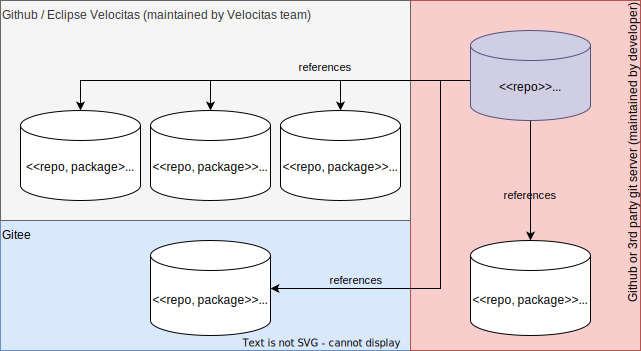

## Introduction

Once a repository has been created from one of our _Vehicle App_ templates, the only way to receive updates into your derived repository is to manually pull in changes - This can be quite tedious and error prone. This is where our _Lifecycle Management_ comes to the rescue!

All of our main components of the development environment

* tools
* runtimes
* devcontainer configuration and setup
* build systems
* CI workflows
* ...

are (or will be) provided as versioned [packages](/docs/lifecycle_management/packages/) which can be updated individually, if required.

The driver for this is our [Velocitas CLI](https://github.com/eclipse-velocitas/cli) which is our package manager for _Vehicle App_ repositories.

## Overview

Here we can see how the `MyVehicleApp` repository references package repositories by _Velocitas_, customer specific packages and some packages from a totally different development platform (Gitee).

If you want to learn more about how to reference and use packages check the sections for [project configuration](/docs/lifecycle_management/project-configuration/) and [packages](/docs/lifecycle_management/packages/usage/).
