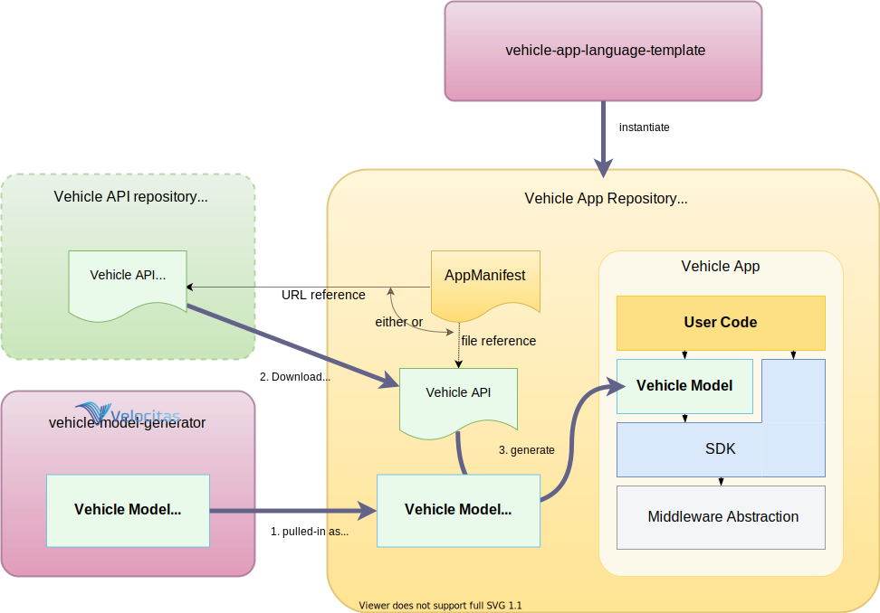

A _Vehicle Model_ makes it possible to easily access vehicle data at the KUKSA Data Broker. It is generated from the underlying semantic model specification for a concrete programming language as a graph-based, strongly-typed, intellisense-enabled library.

{} This article describes our new model lifecycle approach released on Friday, 2023-03-03. With that, the model is now automatically generated with the instantiation of the dev-container. It is generated from the vehicle API referenced in the AppManifest.

For the time being, the integration of services is not supported by the new approach.

The "old" approach, using pre-generated model repositories, is still available and [described here](/docs/tutorials/tutorial_how_to_create_a_vehicle_model/).
{}

This tutorial will show you how:

- the vehicle API used as the source to generate the model is referenced in the app manifest,
- the automatic generation of the model works,
- you can trigger manual recreation of the model (after adding extensions to the API required by your project)

## Prerequisites

- [Visual Studio Code](https://code.visualstudio.com/) with the [Python extension](https://marketplace.visualstudio.com/items?itemName=ms-python.python) installed. For information on how to install extensions on Visual Studio Code, see [VS Code Extension Marketplace](https://code.visualstudio.com/docs/editor/extension-gallery).

## How to Reference a Model Specification

The model specification defines the vehicle API to be used by your project. It is referenced in the `AppManifest.json` via an URI like this: 

  ```json
    "VehicleModel": {
        "src": "https://github.com/COVESA/vehicle_signal_specification/releases/download/v3.0/vss_rel_3.0.json"
    }
  ```

Instead of an URI you could also reference a local file containing the specification.

{} The reference must point to a JSON file containing the model specification as VSS vspec. References to a VSS `.vspec` file hierarchy are not supported as of now.
{}

## Model Creation

The generation of the model is taking place:
* automatically during the instantiation of the dev-container through our [Velocitas lifecycle management](/docs/concepts/lifecycle_management/),
* when an `velocitas init` is triggered manually, or
* you trigger the VS Code task `(Re-)generate vehicle model` explicitly.

The model generation is a three step process:
1. The model generator is installed as a Python package (if not already present)
2. The referenced model specification is downloaded (if no local reference)
3. The model code is generated and installed.



The model is generated using our [Velocitas vehicle-model-generator](https://github.com/eclipse-velocitas/vehicle-model-generator). By default version 0.3.0 is used.
The used version and also the repository of the generator can be altered via the `variables` section of the project configuration in the `.velocitas.json`.
Also, the target folder for the generated model source code is specified here:

```json
{
    "variables": {
        "modelGeneratorGitRepo": "https://github.com/eclipse-velocitas/vehicle-model-generator.git",
        "modelGeneratorGitRef": "v0.3.0",
        "generatedModelPath": "./gen/vehicle_model"
    }
}
```

In Python template based projects the generated model is finally installed in the site-packages folder, whereat in C++ projects it is made available as a cmake include folder.
  
## Further information

- Concept: [SDK Overview](/docs/concepts/vehicle_app_sdk_overview.md)
- Tutorial: [Setup and Explore Development Enviroment](/docs/tutorials/quickstart)
- Tutorial: [Create a Vehicle App]()
