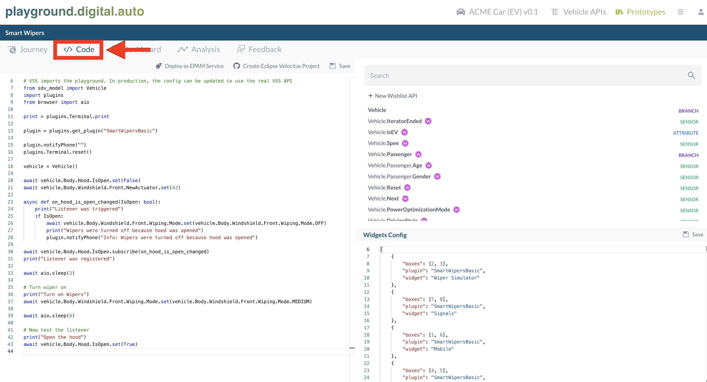

The open and web based [digital.auto](https://digitalauto.netlify.app/) offers a rapid prototyping environment to explore and validate ideas of a vehicle app.
 
[digital.auto](https://digitalauto.netlify.app/) interacts with different vehicle sensors and actuators via standardized APIs specified by the COVESA [Vehicle Signal Specification (VSS)](https://covesa.github.io/vehicle_signal_specification/introduction/) without custom setup requirements.
 
Within the platform you can:

- browse, navigate and enhance vehicle signals (sensors, actuators and branches) in the [Vehicle API Catalogue](https://digitalauto.netlify.app/model/STLWzk1WyqVVLbfymb4f/cvi/list) mapped to a 3D model of the vehicle
- build vehicle app prototypes in the browser using Python and the Vehicle API Catalogue
- test the vehicle app prototype in a dashboard with 3D animation for API calls
- create new plugins, which usually represent UX widgets or remote server communication to enhance the vehicle mockup experience in the playground
- collect and evaluate user feedback to prioritize your development portfolio

## Start the journey of a _Vehicle App_

As first step open [digital.auto](https://digitalauto.netlify.app/), select [_Get Started_](https://digitalauto.netlify.app/model) in the prototyping section of the landing page and use the Vehicle Model of your choice.

You now have the possibility to browse existing vehicle signals for the selected vehicle model which you can use for prototyping your _Vehicle App_ by clicking on _Vehicle APIs_.

### Add additional _Vehicle APIs_

If the ideation of your vehicle app prototype comes with any new Vehicle API which is not part of the standard [VSS](https://covesa.github.io/vehicle_signal_specification/introduction/) you also have the option to include it into your pre-selected model by clicking the _+ New Wishlist API_ button. After filling out all required fields, simply click the _create_ button - this will commit the new API to the existing model.

{}
For this feature, a digital.auto account is required. Get in touch with us or the digital.auto team in case you want to explore this feature
{}

## Prototype an idea of a _Vehicle App_

The next step would be to prototype your idea. To do so:

- Click on _Prototype Library_ of your selected model,

- Create a new prototype, by clicking on _New Prototype_ and filling out the information or select one from the list,
- Click on the _Open_ button,

- Go to the _Code_ section and start your prototype right away.

## Test the prototype of a _Vehicle App_

Testing of your prototype starts in the _Run_ section.
 
You will find a dashboard consisting all vehicle and application components similar to mockups.
 
The control center on the right side has an integrated terminal showing all of your prototyped outputs as well as a list of all called VSS API's.
 
The _Run_ button executes all your prototype code from top to bottom. The _Debug_ button allows you to step through your prototype line by line.

To get started quickly, the digital.auto team has added a number of widgets to simulate related elements of the vehicle – like doors, seats, light, etc. – and made them available in the playground.

Feel free to add your own Plugins with widgets for additional car features (maybe an antenna waving a warm “welcome”…?).

## Transfer your prototype into a Velocitas Vehicle App

In the previous steps you started with envisioning and prototyping your _Vehicle App_ idea and tested it against mocked vehicle components in digital.auto.
 
The Velocitas team provides a project generator to transfer the prototype from [digital.auto](https://digitalauto.netlify.app/) into your own development environment where you are able to test it with real [_Vehicle Services_]().
 
The generator creates a _Vehicle App_ GitHub repository using your prototype code based on our [vehicle-app-python-template](https://github.com/eclipse-velocitas/vehicle-app-python-template).
 
In the 'Code' section of your prototype in [digital.auto](https://digitalauto.netlify.app/) you have the button 'Create Eclipse Velocitas Project'.

After pressing the button you will be forwarded to [GitHub](https://github.com/).
 
Login with your GitHub Account and authorize [velocitas-project-generator](https://github.com/eclipse-velocitas/velocitas-project-generator-npm) to create the repository for you.
 
You will be redirected to [digital.auto](https://digitalauto.netlify.app/) and asked for a repository name (equals to the name of the app).
 
By clicking on "Create repository":

- the project generator takes over your prototype code
- the code is adapted to the structure in the [vehicle-app-python-template](https://github.com/eclipse-velocitas/vehicle-app-python-template)
- a new private repository under your specified GitHub User will be created.

A successful generation of the repository is followed by a pop-up dialogue with the URL of your repository.

Among other things the newly created repository will contain:


| Files | Description |
|-------|-------------|
|_/app/src/main.py_| Main class of the app, containing your modified prototype code |
|_/app/AppManifest.json_| Settings file defining required services |
|_/app/requirements.txt_| Requirements file defining all python dependencies |
|_/.devcontainer/_| Required scripts and settings to setup the devcontainer in Microsoft Visual Studio Code |
|_/.github/workflows/_| All required CI/CD pipelines to build, test and deploy the vehicle application as container image to the GitHub container registry|
|_/gen/vehicle\_model/_| The generated model classes. If your prototype includes any exceptional API you added beforehand our [automated vehicle model lifecycle](/docs/tutorials/vehicle_model_creation/automated_model_lifecycle) takes care of handling the custom VSS vspec file coming from digital.auto and generates a vehicle_model when starting the devContainer |


Your prototype _Vehicle App_ transferred into a GitHub repository is now ready to be extended.
 
Clone your newly created repository and open the _Vehicle App_ in Microsoft Visual Studio Code and start to extend it.

You can proceed with the following topics:

- [Starting development environment](/docs/tutorials/quickstart/#starting-development-environment)
- [Vehicle App Development](/docs/tutorials/vehicle-app-development/tutorial_how_to_create_a_vehicle_app_python/)
