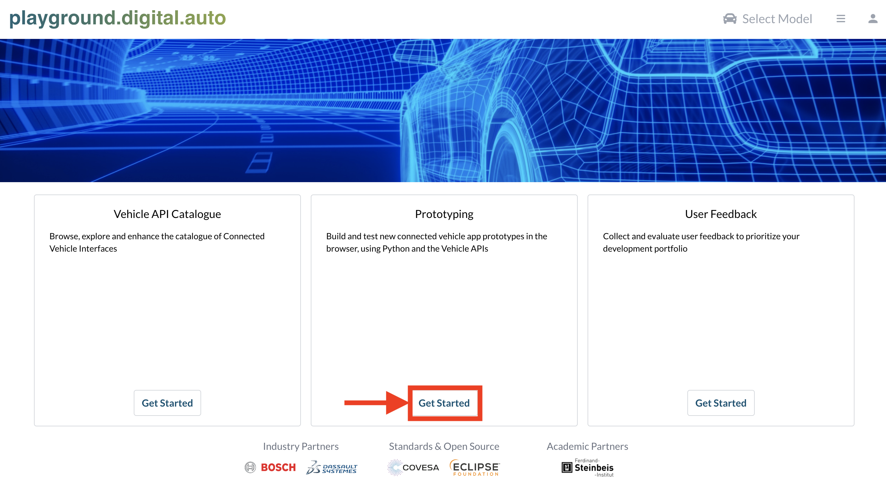
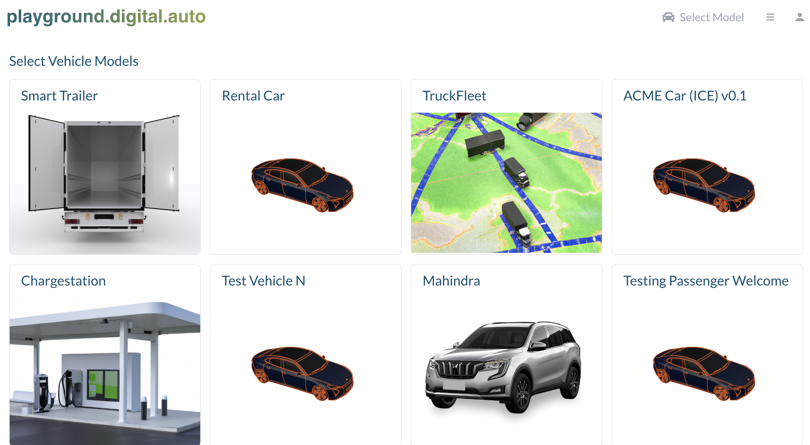

The open and web based [playground.digital.auto](https://digitalauto.netlify.app/) offers a rapid prototyping environment to explore and validate ideas of a vehicle app which interact with different vehicle sensors and actuators via standardized APIs specified by the COVESA [Vehicle Signal Specification (VSS)](https://covesa.github.io/vehicle_signal_specification/introduction/) without custom setup requirements. It provides the opportunity:

- To browse, navigate and enhance the vehicle signals (sensors, actuators and branches) in the [Vehicle API Catalogue]() mapped to a 3D model of the vehicle
- To build vehicle app prototypes in the browser using Python and the Vehicle API Catalogue
- To test the vehicle app prototype in a dashboard with 3D animation for API calls
- To create new plugins, which usually represent UX widgets or remote server communication to enhance the vehicle mockup experience in the playground
- To collect and evaluate user feedback to prioritize your development portfolio

## Prototype an idea of a _Vehicle App_

As first step open [playground.digital.auto](https://digitalauto.netlify.app/), select [_Get Started_](https://digitalauto.netlify.app/model) in the Prototyping section of the landing page and use the Vehicle Model of your choice.

You now have the option to browse existing vehicle signals for the selected vehicle model which you can use for prototyping your _Vehicle App_ by clicking on _Vehicle APIs_.

The next step would be to prototype your idea. To do so:

- Click on _Prototypes_ (in the top right toolbar),
- Create a new prototype, by clicking on _New Prototype_ and filling out the information or select one from the list,
- Click on the _Open_ button (right side),
- Go to the _Code_ section and
- Start your prototype right away.

To test your prototype go to the _Run_ section, which opens a dashboard consisting all vehicle and application components similar to mockups. The control center on the right side has an integrated terminal showing all of your prototyped outputs as well as a list of all called VSS API's. The _Run_ button executes all your prototype code from top to button. The _Debug_ button allows you to step through your prototype line for line.

To get started quickly, the digital.auto team has added a number of widgets to simulate related elements of the vehicle – like doors, seats, light, etc. – and made them available in the playground.

Feel free to add your own Plugins with addition widgets for additional car features (maybe an antenna waving a warm “welcome”…?).

## Next steps
