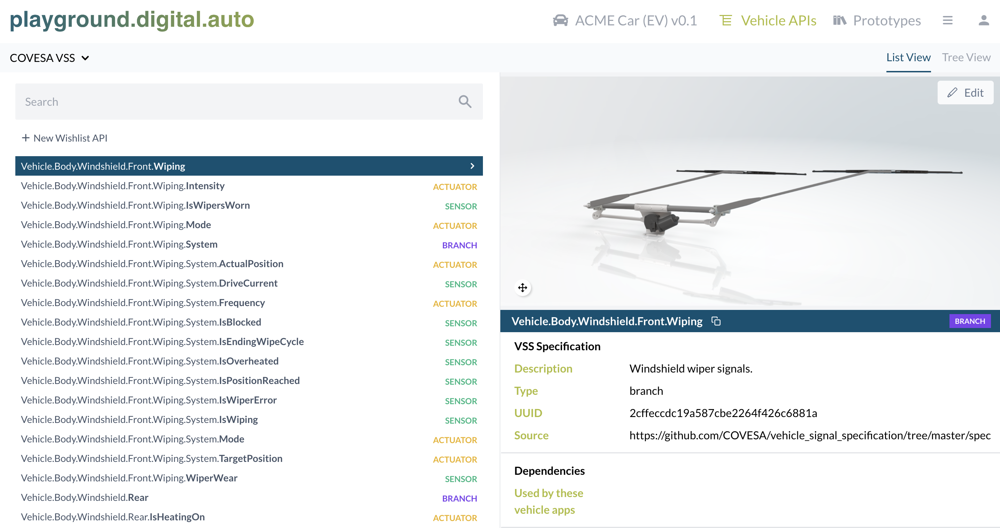
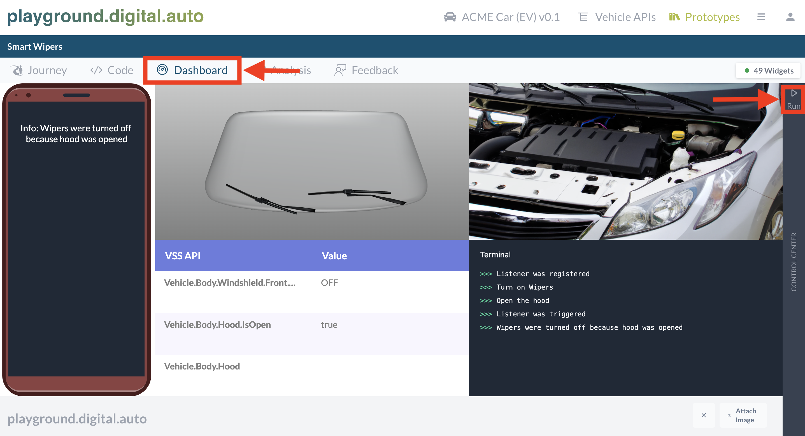

The open and web based [playground.digital.auto](https://digitalauto.netlify.app/) offers a rapid prototyping environment to explore and validate ideas of a vehicle app which interact with different vehicle sensors and actuators via standardized APIs specified by the COVESA [Vehicle Signal Specification (VSS)](https://covesa.github.io/vehicle_signal_specification/introduction/) without custom setup requirements. It provides the opportunity:

- To browse, navigate and enhance the vehicle signals (sensors, actuators and branches) in the [Vehicle API Catalogue]() mapped to a 3D model of the vehicle
- To build vehicle app prototypes in the browser using Python and the Vehicle API Catalogue
- To test the vehicle app prototype in a dashboard with 3D animation for API calls
- To create new plugins, which usually represent UX widgets or remote server communication to enhance the vehicle mockup experience in the playground
- To collect and evaluate user feedback to prioritize your development portfolio

## Prototype an idea of a _Vehicle App_

As first step open [playground.digital.auto](https://digitalauto.netlify.app/), select [_Get Started_](https://digitalauto.netlify.app/model) in the Prototyping section of the landing page and use the Vehicle Model of your choice.

You now have the option to browse existing vehicle signals for the selected vehicle model which you can use for prototyping your _Vehicle App_ by clicking on _Vehicle APIs_.

The next step would be to prototype your idea. To do so:

- Click on _Prototypes_ (in the top right toolbar),
- Create a new prototype, by clicking on _New Prototype_ and filling out the information or select one from the list,
- Click on the _Open_ button (right side),
- Go to the _Code_ section and
- Start your prototype right away.

To test your prototype go to the _Run_ section, which opens a dashboard consisting all vehicle and application components similar to mockups. The control center on the right side has an integrated terminal showing all of your prototyped outputs as well as a list of all called VSS API's. The _Run_ button executes all your prototype code from top to button. The _Debug_ button allows you to step through your prototype line for line.

To get started quickly, the digital.auto team has added a number of widgets to simulate related elements of the vehicle – like doors, seats, light, etc. – and made them available in the playground.

Feel free to add your own Plugins with addition widgets for additional car features (maybe an antenna waving a warm “welcome”…?).

## Transfer your prototype into a Velocitas Vehicle App

In the previous step you started with envision and prototyping your Vehicle App idea and tested it against mocked vehicle components in Digital.Auto. To transfer the prototype from [playground.digital.auto](https://digitalauto.netlify.app/) to your development environment and test it with real [_Vehicle Services_]() we provide a project generator. This generator allows you to generate a Vehicle App GitHub repository using your prototype code based on our [vehicle-app-python-template](https://github.com/eclipse-velocitas/vehicle-app-python-template).

In the 'Code' section of your prototype in the [playground.digital.auto](https://digitalauto.netlify.app/) you have the Button 'Create Eclipse Velocitas Project'.

If you press this button you will be forwarded to [GitHub](https://github.com/) to login with your GitHub Account and authorize _velocitas-project-generator_ to create the repository for you. After you authorized the project generator you will be redirected to the [playground.digital.auto](https://digitalauto.netlify.app/) and asked for a repository name (Which also is the app's name). After pressing "Create repository" the project generator takes over your prototype code, adapts it to the structure in the [vehicle-app-python-template](https://github.com/eclipse-velocitas/vehicle-app-python-template) and creates a new private repository under your GitHub User.

{}
If you would like to know what exactly the generator is doing, please have a look in the code: [velocitas-project-generator-npm](https://github.com/eclipse-velocitas/velocitas-project-generator-npm).
{}

After the generation of the repository is completed a pop-up dialogue with the URL of your repository will be displayed. Among other things the newly created repository will contain:

- _/app/src/main.py_ containing your modified prototype code
- _/app/AppManifest.json_ with definition of required services
- _/app/requirements.txt_ with definition of dependencies
- _/.devcontainer_/ required scripts to install every prerequisite in Microsoft Visual Studio Code
- _/.github/workflows/_ with all required CI/CD pipelines to build, test and deploy the vehicle application as container image to the GitHub container registry

Your prototype Vehicle App transferred into a GitHub repository is now ready to be extended. Clone your newly created repository and open the Vehicle Appl in Microsoft Visual Studio Code. Detailed information you can find here: [Starting development environment](https://eclipse-velocitas.github.io/velocitas-docs/docs/tutorials/quickstart/#starting-development-environment)

{}
By default the template repository comes with automated CodeQL Analysis to automatically detect common vulnerabilities and coding errors. It is available if you have a [GitHub advanced security](https://docs.github.com/en/get-started/learning-about-github/about-github-advanced-security) license in your org or if your repository is public. To do so: Go to your repository settings -> General -> Danger Zone (at the bottom) -> Change repository visibility -> Change visibility to public.
{}
